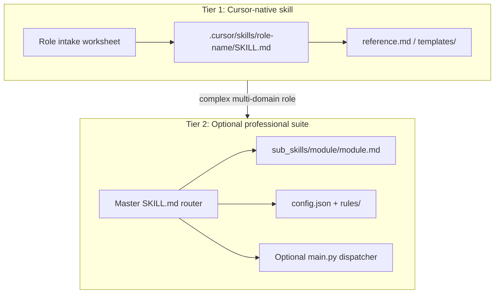

# Generalize Professional Skills Blueprint

## Current state

[`Blueprint & Toolkit- Creating High-Performance Claude Professional Skills.md`](Blueprint%20%26%20Toolkit-%20Creating%20High-Performance%20Claude%20Professional%20Skills.md) is a partial rewrite (lines 1–6 are editor meta, not user content). It already uses generic placeholders in Section 2, but has structural gaps and residual domain bias:

| Issue | Example / impact |
|-------|------------------|
| **Preamble noise** | Lines 1–6 (“fully cleaned…”) should not ship to readers |
| **Path / platform drift** | Uses `.skill/` and `.cursorrules`; Cursor standard is [`.cursor/skills/<name>/SKILL.md`](C:\Users\Rico\.cursor\skills-cursor\create-skill\SKILL.md) with YAML frontmatter |
| **Directory tree inconsistency** | Section 1 tree omits `rules/`; Section 2 template references `./rules/compliance.md` |
| **Engineering-only math examples** | Section 5 uses beam deflection ($WL^3/384EI$), “modulus of elasticity”; compliance uses universal $SF \ge 1.5$ (not valid for legal/finance/HR roles) |
| **Missing sub-skill / routing guidance** | Repo pattern ([`Claude Desktop/SKILL.md`](Claude%20Desktop/SKILL.md), [`main.py`](Claude%20Desktop/main.py), [`sub_skills/*/`](Claude%20Desktop/sub_skills/)) is the real “professional suite” but undocumented in blueprint |
| **Incomplete ending** | Section 6 checklist has 3 items only; no verification, anti-patterns, or role-intake workflow |
| **No link to Cursor create-skill norms** | Missing: description triggers, &lt;500 lines, progressive disclosure, `disable-model-invocation` |

The HK architect repo remains a **reference implementation**, not the default assumption for every role.



---

## Target document structure (revised outline)

Replace the current 6 sections with this flow (~250–350 lines, concise):

1. **Purpose and when to use this toolkit** — who it’s for; Tier 1 vs Tier 2 decision table
2. **Role intake worksheet** (new) — fill before scaffolding:
   - Role title, jurisdiction/context, governance frameworks, stakeholders, deliverable types, halt conditions, vocabulary/acronyms, sub-domains worth isolating
3. **Tier 1: Cursor-native skill** (align with create-skill)
   - Paths: personal `~/.cursor/skills/` vs project `.cursor/skills/`
   - Required YAML frontmatter (`name`, `description` with WHAT + WHEN triggers)
   - Lean `SKILL.md` structure: identity, workflow phases, output constraints, links to `reference.md` / `templates/`
   - Progressive disclosure rule (one hop to references)
4. **Tier 2: Professional suite** (generalized from [`Claude Desktop/`](Claude%20Desktop/))
   - Canonical directory tree (fix `rules/` in tree):

```text
professional-suite/
├── SKILL.md                 # Master router + quick reference + dispatch rules
├── config.json              # Boundaries, strict_mode, compliance flags
├── rules/
│   ├── compliance.md        # Non-negotiable standards
│   └── operational.md       # Workflow SOPs
├── sub_skills/
│   └── <module-id>/
│       ├── <module-id>.md
│       └── references/      # Optional deep refs
├── vocabulary/
│   └── domain_terms.json
├── templates/
│   └── ...
└── main.py                  # Optional: load_sub_skill registry (only if needed)
```

   - Sub-skill template (frontmatter + “when to use / use instead” table — pattern from [`hk-procurement-strategy.md`](Claude%20Desktop/sub_skills/hk-procurement-strategy/hk-procurement-strategy.md))
   - Markdown-only routing vs Python dispatcher: use dispatcher only when you need programmatic calculators or strict ID validation; otherwise route via master `SKILL.md` decision tree
5. **Master `SKILL.md` blueprint** — retain 4-phase cognitive workflow; generalize examples across domains (legal, finance, clinical, software, operations)
6. **Configuration and compliance engines** — replace engineering-only constraints with **role-pluggable constraint sets**:
   - Integrity / confidentiality (all roles)
   - Quantitative thresholds (role-specific: e.g. latency SLA, materiality %, clinical dose limits — not hard-coded $SF$)
   - Jurisdiction / licensing boundaries
7. **Domain-neutral formula & notation guide** (rewrite Section 5)
   - Inline: ROI, error rate, confidence interval, budget variance
   - Display: generic multi-factor model (keep $T_c$ pipeline example or swap for NPV / risk score)
   - Explicit note: include formulas only when the role produces quantitative artifacts
8. **Cursor Plan Mode playbook** (update Section 4)
   - Scaffolding prompt using Tier 1 or Tier 2
   - Activation via project rules [`.cursor/rules/`](.cursor/rules/) or `AGENTS.md` — not legacy `.cursorrules` alone
   - Verification prompts (golden questions, expected halt behavior)
9. **Quality checklist** (expand Section 6)
   - Explicit constraints, vocabulary populated, halt criteria, description triggers, line budget, cross-links between sub-skills, no AI fluff, assumptions declared
10. **Anti-patterns** (new) — monolithic 2k-line SKILL.md, vague “be professional”, duplicate sub-skills, missing “use instead” routing, jurisdiction mixed without flags
11. **Appendix: Reference implementation** — one short paragraph pointing to [`Claude Desktop/`](Claude%20Desktop/) as HK architecture example only

---

## Specific content edits

### Remove / relocate
- Delete lines 1–6 meta preamble (or move to a one-line doc version footer: `Version 2.0`)
- Remove `.skill/` as primary path; document as legacy alias if needed

### Generalize examples (cross-industry)
| Current | Replacement |
|---------|-------------|
| Senior Systems Architect only in title examples | Rotate: Compliance Auditor, Clinical Operations Lead, M&A Analyst, Staff Engineer |
| OWASP + “material risks for finance” lumped | Split by domain in compliance template with `[Domain Pack]` placeholders |
| Beam / elasticity formula | Budget variance, SLA breach rate, or diagnostic sensitivity/specificity |
| `target_governance_framework: "Global Enterprise Standards"` | Instruct author to set real framework (SOX, ISO 27001, HIPAA, local bar rules) |

### Add sub-skill snippet (new template block)
Mirror proven repo pattern:

```markdown
---
name: <module-id>
description: <third-person WHAT + WHEN triggers>
---

# <Module Title>

For <X>, use `<other-module-id>` instead.

## When to Use This Skill
| Question type | This skill | Use instead |
|---|---|---|
```

### Align Plan Mode scaffolding prompt
Replace Phase A prompt to branch on tier:

```text
Using the Professional Skills Blueprint (Tier 1 or Tier 2), scaffold a [Role Name] skill.
Tier 1: .cursor/skills/<slug>/SKILL.md + reference.md
Tier 2: full suite with master router, 3–N sub_skills, rules/, vocabulary/, templates/
```

### Wire-in create-skill principles (short callouts, not duplicate)
- `description` max 1024 chars, third person, trigger terms
- Keep master `SKILL.md` under ~500 lines; push depth to `references/`
- Default `disable-model-invocation: true` unless ambient auto-load is intended

---

## Files to change

| File | Action |
|------|--------|
| [`Blueprint & Toolkit- Creating High-Performance Claude Professional Skills.md`](Blueprint%20%26%20Toolkit-%20Creating%20High-Performance%20Claude%20Professional%20Skills.md) | Full restructure per outline above |
| [`Role Create Prompt.txt`](Role%20Create%20Prompt.txt) | Optional follow-up: align prompt bullets with new intake worksheet (only if you want prompts synced in same PR) |

No changes to [`Claude Desktop/`](Claude%20Desktop/) skills unless you later ask to add a `docs/` symlink or README link from blueprint appendix.

---

## Verification (after edit)

- Read-through: no construction/HK terms in generic templates (only in Appendix)
- Tree vs template path consistency (`rules/` present everywhere referenced)
- Tier decision table: a “personal assistant” maps to Tier 1; a “multi-regulation compliance officer” maps to Tier 2
- Spot-check against [`create-skill/SKILL.md`](C:\Users\Rico\.cursor\skills-cursor\create-skill\SKILL.md) for frontmatter and description rules
