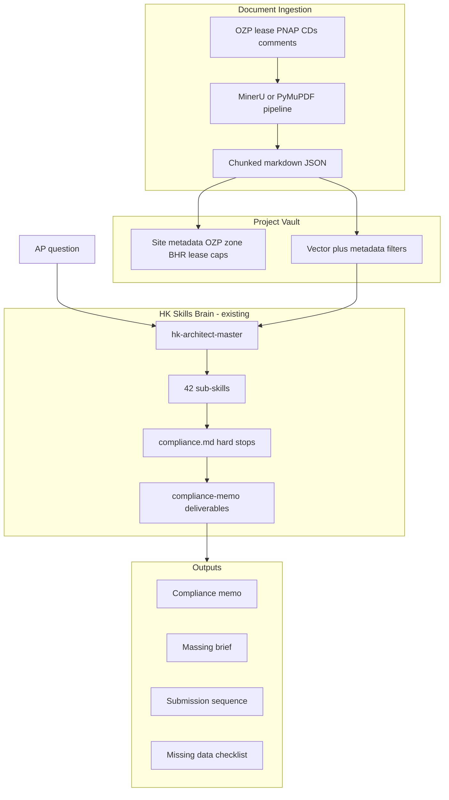

# HK Architect Desk — Product Brainstorm and Open-Source Stack

## Executive recommendation

Build **HK Architect Desk**: a **project-scoped advisory copilot** for Hong Kong design APs that answers “Is this massing/submission strategy viable on *this* site?” by combining:

1. **Skills module (this repo)** — [Claude Desktop/SKILL.md](Claude Desktop/SKILL.md) master router, 42 sub-skills, [rules/compliance.md](Claude Desktop/rules/compliance.md), [templates/](Claude Desktop/templates/), [vocabulary/domain_terms.json](Claude Desktop/vocabulary/domain_terms.json), installable via `hk_architect_skills/`
2. **Architect Desk app (separate repo)** — [Architect Desk-HK/architect_desk/](https://github.com/) Project Vault, site facts, grounded artifacts, MCP; depends on `hk-architect-skills`

This is the narrowest high-value wedge for your chosen persona (design AP) and integration level (documents, not BIM/schedules in v1).



---

## Problem framing (YC-style forcing questions)

| Question | Answer for HK design APs |
|----------|--------------------------|
| **Desperate specificity** | “Does this tower massing breach OZP Notes *and* lease GFA on Lot XYZ?” — requires site docs, not generic PNAP recall |
| **Status quo** | AP manually cross-reads OZP PDF, LandsD lease, PNAP memos, prior BD comments; junior drafts memo; partner reviews |
| **Observation** | Your suite already handles *generic* HK compliance well; it fails when answers depend on *project files* the model cannot see |
| **Narrowest wedge** | **Site Pack Intelligence** — ingest OZP + lease + key PNAP extracts → structured site facts → compliance memo / massing brief |
| **10-star version** | Upload full CD set; auto-extract area schedule + drawing index; cross-check GFA/egress against ingested data; track BD comment resolution |

---

## Product options considered (ranked for your choices)

### Option A — **HK Architect Desk** (recommended)

**One-liner:** Chat + project vault for HK statutory and submission work.

**Core jobs-to-be-done:**
- Ingest and summarize **OZP**, **lease conditions**, **planning approval letters**, **BD/FSD comment letters**
- Produce [Architect Desk-HK/architect_desk/templates/compliance-memo.md](../Architect%20Desk-HK/architect_desk/templates/compliance-memo.md) (Desk) or [Claude Desktop/templates/compliance-memo.md](Claude Desktop/templates/compliance-memo.md) (skills), massing briefs, submission sequences using existing sub-skills
- **Halt** when OZP Notes or lease not in vault (reuse compliance rules — do not invent site facts)

**Why this wins:** Directly extends [Skills-Architects-HK](README.md) without throwing away 42 skills; matches design AP daily work; document RAG is achievable with mature OSS.

---

### Option B — **Submission Readiness Checker** (feature inside A)

Focused module: given uploaded docs, score readiness for GP/OP milestones using [Architect Desk-HK/architect_desk/templates/op-readiness-matrix.md](../Architect%20Desk-HK/architect_desk/templates/op-readiness-matrix.md) or skills [templates/op-readiness-matrix.md](Claude Desktop/templates/op-readiness-matrix.md) and `hk-op-submission-strategy`.

Good as **Phase 2** marketing hook, not standalone product (too narrow to sell alone).

---

### Option C — **Construction Drawing Intelligence** (Phase 2+)

Parse PDF CDs for drawing schedules, area tables, keynote legends — inspired by [BlueprintParser_OS](https://github.com/goodmorningcoffee/BlueprintParser_OS) and [MinerU](https://github.com/opendatalab/MinerU).

High value for APs at DD/CD stage but heavier ML/OCR investment; defer until Site Pack proves retention.

---

### Option D — **BIM Compliance Co-Pilot** (not v1 — you deferred BIM)

[IfcOpenShell](https://github.com/IfcOpenShell/IfcOpenShell) + [IfcTester/IDS](https://github.com/vinnividivicci/ifc-ids-mcp) + YAML rule packs ([BIMFlow Suite](https://github.com/Nnamdi-Oniya/bimflowsuite) pattern).

Strategic for future **HK IDS rule packs** (GFA-relevant attributes, fire compartment tags) but wrong first wedge for chat-only AP workflow.

---

### Option E — **Practice Operations Hub** (PM/CA persona — deprioritize)

[CMCP](https://github.com/lordqueso/mcp-construction), [MeridianIQ](https://github.com/VitorMRodovalho/meridianiq), [project-mcp](https://github.com/jeffmodeler/project-mcp) cover RFIs, schedules, cost — valuable later if you expand to whole-studio.

---

## Recommended v1 feature set (8–12 weeks realistic scope)

### Must-have
1. **Project Vault** — per-project upload store (local-first; optional S3 later)
2. **Doc types with parsers** — OZP, lease, PNAP/guidance PDFs, authority comment letters, generic specs
3. **Site Facts extraction** — structured JSON: zone, PR/SC/BHR, Notes flags, lease GFA cap, use restrictions, aviation/ridgeline flags
4. **Grounded Q&A** — every statutory claim cites retrieved chunk + skill reference; unknown → gap list
5. **Artifact generators** — compliance memo, massing summary, submission sequence outline
6. **MCP or plugin surface** — expose `load_project`, `search_project_docs`, `get_site_facts`, `run_hk_calculator` alongside existing `load_sub_skill`

### Nice-to-have (v1.1)
- Email attachment ingest (pattern from [aec-outlook-mcp](https://github.com/dongwoosuk/aec-outlook-mcp))
- Drawing schedule table extraction from PDF CDs (MinerU tables → CSV)
- Multi-project portfolio search (“which projects have OZP OU zones?”)

### Explicitly out of v1
- Revit/IFC integration ([RevitMCPBridge2026](https://github.com/WeberG619/RevitMCPBridge2026), [APS AEC DM MCP](https://github.com/autodesk-platform-services/aps-aecdm-mcp-dotnet))
- Primavera/MS Project ([pyp6xer-mcp](https://github.com/paulieb89/pyp6xer-mcp), [project-mcp](https://github.com/jeffmodeler/project-mcp))
- Automated statutory sign-off (keep advisory + halt posture from skills [config.json](Claude Desktop/config.json) and Desk [architect_desk/config.json](../Architect%20Desk-HK/architect_desk/config.json))

---

## Open-source library map (what to adopt vs. borrow patterns from)

### Tier 1 — Adopt directly in v1

| Library | Role | Fit for HK Architect Desk |
|---------|------|---------------------------|
| **[MinerU](https://github.com/opendatalab/MinerU)** | PDF → Markdown/JSON; tables, multi-column, OCR | Best for PNAP/OZP/lease PDFs; has MCP server path |
| **[PyMuPDF (fitz)](https://pymupdf.readthedocs.io/)** | Fast PDF text/bbox extraction | Lightweight fallback; good for digital-born gov PDFs |
| **[RAGFlow](https://github.com/infiniflow/ragflow)** or **ChromaDB + LangChain** | RAG orchestration, chunking, hybrid search | RAGFlow = faster MVP UI; Chroma = simpler self-host |
| **[IfcOpenShell](https://github.com/IfcOpenShell/IfcOpenShell)** | — | **Not v1**; bookmark for Phase 3 BIM |
| **Your skills repo** | Skills, rules, templates, calculators | **Core IP** — `hk_architect_skills` package; no vault |

### Tier 2 — Patterns to copy (selective integration)

| Project | Borrow |
|---------|--------|
| [BlueprintParser_OS](https://github.com/goodmorningcoffee/BlueprintParser_OS) | Sheet indexing, schedule-to-Excel, CSI tagging for CD phase |
| [aec-outlook-mcp](https://github.com/dongwoosuk/aec-outlook-mcp) | Local RAG + attachment parsing architecture |
| [ClaudeHopper MCP](https://mcp.aibase.com/server/1916341209515401218) | Construction-doc chunking + metadata extraction |
| [ifc-ids-mcp](https://github.com/vinnividivicci/ifc-ids-mcp) | Deterministic validation pattern for future HK IDS packs |
| [BIMFlow Suite](https://github.com/Nnamdi-Oniya/bimflowsuite) | YAML rule-pack engine for compliance checks |
| [opensource.construction IFC Model Checker](https://opensource.construction/projects/ifc-model-checker/) | Browser-local WASM validation UX (privacy model) |

### Tier 3 — Ecosystem / inspiration (skills-only competitors)

| Project | Relationship |
|---------|--------------|
| [Amanbh997/Skills-Architects](https://github.com/Amanbh997/Skills-Architects) | Upstream framework you localized — stay compatible |
| [AlpacaLabsLLC/skills-for-architects](https://github.com/AlpacaLabsLLC/skills-for-architects) | NYC data APIs model — HK equivalent = LandsD/PlanD/BD open data hooks (Phase 2) |
| [Agentic-BIM-Compliance](https://github.com/Prajwalkadam29/Agentic-BIM-Compliance) | Multi-agent + GraphRAG reference for Phase 3 |

---

## Proposed architecture (two-repo split)

**Skills-Architects-HK** — installable module; Claude plugin content only:

```text
Skills-Architects-HK/
├── hk_architect_skills/           # pip install -e .
│   ├── dispatcher.py               # load_sub_skill, run_hk_calculator
│   ├── paths.py                    # HK_ARCHITECT_SKILLS_ROOT → Claude Desktop/
│   └── core/calculators.py
└── Claude Desktop/                 # claude --plugin-dir target
    ├── SKILL.md                    # Master router (no vault §0)
    ├── sub_skills/                 # 42 specialist skills
    ├── rules/, templates/, vocabulary/
    └── main.py                     # Shim → hk_architect_skills
```

**Architect Desk-HK** — standalone application; depends on skills module:

```text
Architect Desk-HK/
├── architect_desk/                 # Main program
│   ├── dispatcher.py             # Composes HKSkillsDispatcher + ProjectVault
│   ├── main.py                   # Full tool dispatch (skills + vault)
│   ├── mcp_server.py
│   ├── core/site_facts.py
│   ├── vault/                    # ingest, chunker, indexer, store, artifacts
│   ├── templates/                # compliance-memo, massing-brief (Desk-owned)
│   ├── rules/operational.md      # Vault-first routing SOP
│   ├── SKILL.md                  # Desk router (§0 Project Vault)
│   └── config.json
├── data/vault/                   # Local project storage (gitignored)
├── Skills-Architects-HK/         # Path dep: pip install -e ./Skills-Architects-HK
└── pyproject.toml                # depends on hk-architect-skills + pymupdf
```

**Install:**

```bash
# Skills only
pip install -e /path/to/Skills-Architects-HK

# Full Desk
pip install -e /path/to/Skills-Architects-HK
pip install -e /path/to/Architect-Desk-HK
```

**Retrieval strategy (Architect Desk — critical for AP trust):**
1. Classify query → statutory (route to `hk_architect_skills`) vs. site-specific (search vault)
2. Keyword index + metadata filters (`doc_type=ozp`, `project_id`, `lot_no`) in [architect_desk/vault/](../Architect%20Desk-HK/architect_desk/vault/)
3. Inject retrieved chunks + [domain_terms.json](Claude Desktop/vocabulary/domain_terms.json) expansions into context
4. Apply Desk [rules/compliance.md](../Architect%20Desk-HK/architect_desk/rules/compliance.md) halts if OZP Notes or lease not indexed

---

## Differentiation vs. generic construction AI

| Generic RAG / ChatGPT | HK Architect Desk |
|----------------------|-------------------|
| May invent PNAP clauses | Hard halt + citation requirement |
| No HK workflow templates | Desk [templates/](../Architect%20Desk-HK/architect_desk/templates/) + skills [templates/](Claude Desktop/templates/) + sub-skill routing |
| One-size global codes | BO/PNAP/FS Code/OZP/lease ontology |
| No calculators | [hk_architect_skills/core/calculators.py](hk_architect_skills/core/calculators.py); Phase 2 wire to vault area schedules |
| Cloud-only docs | **Local-first** option (important for lease/confidential projects) |

---

## Phased roadmap

### Phase 1 — Site Pack MVP (6–8 weeks)
- Project vault + OZP/lease/PNAP ingest
- Site Facts JSON extraction (human confirm step)
- Grounded compliance memo + massing brief
- MCP tools wired to existing dispatcher

### Phase 2 — Submission & CD intelligence (8–12 weeks)
- BD comment letter tracker (issue → status → sub-skill remedial path)
- Drawing schedule / area table extraction from PDF CDs
- Connect `gfa_aggregator` to parsed schedule data

### Phase 3 — Data enrichment (optional)
- HK open data APIs (PlanD zoning, BD lists) — Alpaca-style live lookups
- Email ingest via Outlook MCP pattern
- Portfolio-level search across projects

### Phase 4 — BIM layer (when AP workflow matures)
- IFC export from Revit → IfcTester IDS checks
- HK YAML rule packs (travel distance, compartment area) — BIMFlow pattern
- 3D overlay via xeokit (Agentic-BIM-Compliance pattern)

---

## Business / deployment models to decide later

- **Studio license** — local vault on NAS; Claude Desktop / Cursor plugin
- **Hosted SaaS** — multi-tenant vault (careful with lease confidentiality)
- **Open-core** — OSS skills + vault; paid HK rule packs / enterprise SSO

Recommendation: **local-first MVP** aligns with HK practice confidentiality norms and [aec-outlook-mcp](https://github.com/dongwoosuk/aec-outlook-mcp) privacy positioning.

---

## Key risks and mitigations

| Risk | Mitigation |
|------|------------|
| Hallucinated site facts | Site Facts schema + human confirmation gate; halt without docs |
| OCR errors on scanned OZP | MinerU OCR + show source page snippets in output |
| Skills/docs drift | Version vault index when PNAP updates; date-stamp knowledge layer |
| Over-scoping BIM | Defer per your v1 choice; skills already cover advisory BIM LOD |
| Calculator trust | Keep "advisory not sign-off" disclaimers from [hk_architect_skills/core/calculators.py](hk_architect_skills/core/calculators.py) |

---

## Success metrics (design AP wedge)

- Time to first **compliance memo draft** from Site Pack upload: under 15 minutes
- **Citation rate**: 100% of statutory assertions linked to vault chunk or skill section
- **Halt accuracy**: system refuses massing conclusion when OZP Notes missing (golden tests in [Architect Desk-HK/architect_desk/VERIFICATION.md](../Architect%20Desk-HK/architect_desk/VERIFICATION.md))
- AP qualitative: “I would send this to internal review” on 3 real projects

---

## Immediate next steps (after plan approval)

1. Define [Architect Desk-HK/architect_desk/vault/schemas/site_facts.json](../Architect%20Desk-HK/architect_desk/vault/schemas/site_facts.json)
2. Spike MinerU on 3 real HK doc types via [architect_desk/vault/spike_ingest.py](../Architect%20Desk-HK/architect_desk/vault/spike_ingest.py)
3. Desk MCP tools in [architect_desk/dispatcher.py](../Architect%20Desk-HK/architect_desk/dispatcher.py): `create_project`, `upload_document`, `get_site_facts`, `search_project`
4. Desk [SKILL.md](../Architect%20Desk-HK/architect_desk/SKILL.md) §0 vault routing; skills [SKILL.md](Claude Desktop/SKILL.md) unchanged (statutory only)
5. [Architect Desk-HK/architect_desk/VERIFICATION.md](../Architect%20Desk-HK/architect_desk/VERIFICATION.md) grounded-RAG golden prompts
6. `pip install -e .` for [pyproject.toml](pyproject.toml) (`hk-architect-skills` module)
