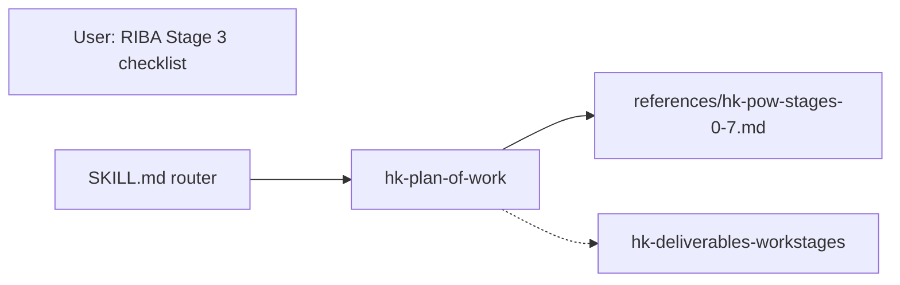

# HK Plan of Work Sub-Skill

## Goal

Add [`hk-plan-of-work`](Claude Desktop/sub_skills/hk-plan-of-work/hk-plan-of-work.md) as a dedicated sub-skill containing **RIBA Plan of Work Stages 0–7** task checklists, localized for Hong Kong and cross-linked to existing skills (`hk-project-management`, `hk-cost-consultancy`, `hk-tender-contract-administration`, etc.).

This complements [`hk-deliverables-workstages`](Claude Desktop/sub_skills/hk-deliverables-workstages/hk-deliverables-workstages.md) (what to **issue**) with process **checklists** (what to **do/verify** at each stage).

---

## Architecture



| File | Role |
|------|------|
| `hk-plan-of-work.md` | Frontmatter, HK mapping tables, substitution guide, how to use checklists, stage-gate summary |
| `references/hk-pow-stages-0-7.md` | Full bilingual checklists (user input, HK-adapted) — Stages 0–7 |
| [`main.py`](Claude Desktop/main.py) | Register `hk-plan-of-work` in `valid_skills` |
| [`SKILL.md`](Claude Desktop/SKILL.md) | Routing branch + Role Coverage Index row |

---

## Stage mapping (RIBA ↔ HK ↔ existing deliverables letters)

| RIBA stage | HK label | BD / statutory anchor | Maps to deliverables §2 |
|------------|----------|------------------------|------------------------|
| 0 Strategic Definition | Feasibility / commission | Site constraints, OZP, lease | Stage A |
| 1 Preparation and Briefing | Brief and team setup | Team appointments, brief sign-off | Stage A–B |
| 2 Concept Design | Concept | Pre-app, massing, PA optional | Stage B |
| 3 Spatial Coordination | Developed / coordinated design | GBP coordination, s.16 if needed | Stage C |
| 4 Technical Design | Tender / detailed design | Tender set, specs, BoQ | Stage E |
| 5 Manufacturing and Construction | Construction | Consent, site, CA | Stage F–G |
| 6 Handover | PC, DLP, OP | BA14, OP, O&M | Stage H–I |
| 7 Use | In-use / POE | BEAM Plus EB, FM feedback | Post-Stage I |

Include this table in the main skill file so agents can jump between PoW checklists and deliverable packs.

---

## HK substitution guide (apply throughout checklists)

Replace or augment UK-specific items as follows:

| RIBA / UK reference | Hong Kong equivalent |
|---------------------|----------------------|
| ARB / RIBA requirements | **HKIA** Code of Conduct, registration; **AR** under Buildings Ordinance where acting as AP |
| RIBA Professional Services Contract | **HKIA / HKIS appointment** (e.g. Archi-SOR, consultant agreement); see `hk-fee-proposal-strategy` |
| CDM Regulations / Principal Designer | **Construction safety coordination** (Cap. 59 FIU, Construction Sites (Safety) Regulations, OSH Cap. 509); see `hk-construction-health-safety` |
| Party Wall Act | **Adjoining owner / DMC / common wall** agreements; LandsD / building management interfaces — not UK Party Wall |
| Planning and building approvals | **Town Planning Ordinance** (s.16 / s.12A, OZP) + **Buildings Ordinance** (AP/RSE, GBP, consent, OP) — see `hk-spatial-planning`, `hk-construction-documentation` |
| BREEAM | **BEAM Plus** (NB / EB); appoint BEAM Pro early — see `hk-building-sustainability` |
| UK EPC / Display Energy Certificate | **BEEO**, **Energy Audit** (commercial), disclosure where applicable — not UK EPC |
| CIBSE TM31 log book | O&M manuals, **as-built**, FM handover packs per contract |
| Building Contract (generic) | **SFBC** (WQ/WOQ), **GCC-Building**, **D&B**, **NEC** — see `hk-tender-contract-administration` §4A |
| Clerk of works | **Site inspector / clerk of works** under CA; distinguish from **AP/RSE** statutory supervision (`hk-site-supervision`) |
| Energy Performance Certificate (sell/lease) | HK energy/compliance obligations as applicable; verify project type |

Keep **bilingual headings** (English | 中文) from user input for each checklist item.

---

## Content structure for `references/hk-pow-stages-0-7.md`

Preserve the user's hierarchy:

- `STAGE N — Title`
  - Client Team / Design Team / Construction Team / Cost / Other Activities / BIM (as in source)
  - Each item: `- [ ]` checkbox, English title, 中文, bullet actions
  - Inline **HK note** only where substitution or cross-skill routing is needed (avoid duplicating full regulatory text)

**Per-stage HK additions** (short blocks at top of each stage):

| Stage | HK-specific reminders |
|-------|----------------------|
| 0 | PI insurance (`hk-professional-indemnity`); fee basis (`hk-fee-proposal-strategy`); conflict check |
| 1 | Consultant RACI (`hk-project-management`); statutory obligations list (BD, PlanD, LandsD, EPD, FSD) |
| 2 | OZP/BHR/massing (`hk-concept-design`); BEAM Plus target; cost plan Rev 0 (`hk-cost-consultancy`) |
| 3 | Coordination freeze; planning application if required (`hk-spatial-planning`) |
| 4 | Tender package + SFBC form ID; specialist tenders; materials approval |
| 5 | Consent to commence (`hk-consent-scheduling`); CA playbook §12; valuations; EOT register |
| 6 | PC / Making Good Defects / Final cert (`hk-practical-completion-snagging` §10); OP (`hk-op-submission-strategy`) |
| 7 | POE / soft landings; BEAM Plus In-Use; separate appointment scope |

---

## Main skill file sections (`hk-plan-of-work.md`)

1. **Scope** — when to use vs `hk-deliverables-workstages`, `hk-project-management`
2. **Stage mapping table** (above)
3. **HK substitution guide** (condensed table)
4. **How to run a stage gate** — client written approval, accounts settled, stage report issued (align with RIBA 2.1.10, 3.5.8, etc.)
5. **Role routing** — which checklist sections map to six roles (CA → Stage 5 Construction; QS → Cost sections; H&S → 2.5.4 / 5.1.13 / 5.5.22)
6. **Reference pointer** — full checklists in `references/hk-pow-stages-0-7.md`; dispatcher exposes via `references_available`

---

## Router updates

### [`SKILL.md`](Claude Desktop/SKILL.md)

Add decision-tree branch (after deliverables branch):

```
├─ RIBA plan of work, stage checklist, stage gate, Stage 0–7 tasks, strategic definition, handover checklist?
│   └─► [hk-plan-of-work]
```

Extend **Role Coverage Index** with row:

| Role | Duty | Primary | Secondary |
|------|------|---------|-----------|
| All roles | Stage task checklists 0–7 | `hk-plan-of-work` | `hk-deliverables-workstages` |

Add `hk-plan-of-work` to `load_sub_skill` valid IDs list (40 skills total).

Update sub-skill count in intro (39 → 40).

### [`main.py`](Claude Desktop/main.py)

Add `"hk-plan-of-work"` to `valid_skills` (alphabetically near `hk-op-submission-strategy`).

### Cross-links (one-line each)

- [`hk-deliverables-workstages`](Claude Desktop/sub_skills/hk-deliverables-workstages/hk-deliverables-workstages.md) — add §6.10 pointing to `hk-plan-of-work` for process checklists vs issue packs
- [`hk-project-management`](Claude Desktop/sub_skills/hk-project-management/hk-project-management.md) — mention PoW stage gates in delivery plan section

---

## Implementation approach

1. Create folder `Claude Desktop/sub_skills/hk-plan-of-work/`
2. Write `hk-plan-of-work.md` (~120–150 lines) with mapping, guide, gates
3. Write `references/hk-pow-stages-0-7.md` — adapt full user checklist (~800–1000 lines): systematic pass applying substitution guide; add `skill_id` cross-refs as footnotes on high-value items only (not every line)
4. Wire `main.py` + `SKILL.md`
5. Add cross-links in deliverables + project-management
6. Verify: `python -c "from main import HKArchitectDispatcher; ... load_sub_skill('hk-plan-of-work')"`

---

## Success criteria

- Stages 0–7 checklists present with bilingual labels and HK substitutions on all UK-specific items
- Invocable via `load_sub_skill('hk-plan-of-work')` and routable from master SKILL.md
- Clear separation: **checklists** (PoW) vs **deliverables** (issue packs)
- Stage gates and role sections traceable to existing role skills from the coverage plan
