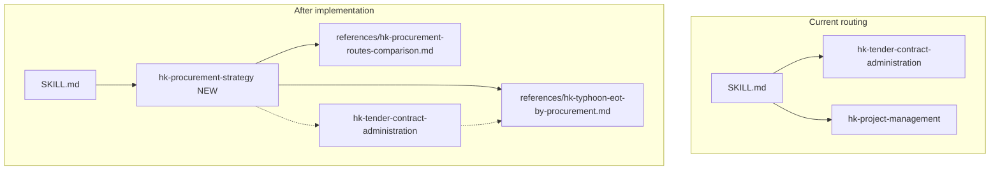

# HK Procurement Strategy Coverage Plan

## Gap analysis (current state)

Your four procurement “roles” are **not fully covered** today. Existing content is fragmented and shallow:

| Route | Where it appears today | Coverage level |
|-------|------------------------|----------------|
| **Traditional (Design-Bid-Build)** | [`hk-tender-contract-administration`](Claude Desktop/sub_skills/hk-tender-contract-administration/hk-tender-contract-administration.md) §4A (`SFBC-Private-WQ`, `GCC-Building`) | **Partial** — contract IDs only; no mechanism, risk split, BD 28-day programme, premium-residential fit |
| **Design & Build** | Same §4A (`D&B-HK`); plan-of-work mentions D&B gates | **Partial** — no ArchSD/DEVB forms, ER control, fast-track packages, design-delay EOT trap |
| **Management Contracting / Construction Management** | One-line mentions in [`hk-project-management`](Claude Desktop/sub_skills/hk-project-management/hk-project-management.md) §4 and [`hk-deliverables-workstages`](Claude Desktop/sub_skills/hk-deliverables-workstages/hk-deliverables-workstages.md) §6.7 | **Missing** |
| **NEC4 / partnering** | [`hk-tender-contract-administration`](Claude Desktop/sub_skills/hk-tender-contract-administration/hk-tender-contract-administration.md) §10–11 (ECC options, CE/EW registers) | **Partial** — no DEVB mandatory context, Option C pain/gain narrative, comparison matrix, typhoon as CE |
| **Typhoon EOT by procurement** | §12.8 generic SFBC EOT; NEC CE mentioned; typhoon elsewhere = **wind loading** only | **Missing** |



---

## Recommended architecture (per your choice: new sub-skill)

Follow the same pattern as [`hk-plan-of-work`](Claude Desktop/sub_skills/hk-plan-of-work/hk-plan-of-work.md): a **lean main skill** + **heavy reference files** loaded via dispatcher `references_available`.

### New files

| File | Purpose |
|------|---------|
| [`Claude Desktop/sub_skills/hk-procurement-strategy/hk-procurement-strategy.md`](Claude Desktop/sub_skills/hk-procurement-strategy/hk-procurement-strategy.md) | Frontmatter, when-to-use table, route selector, summary comparison matrix, stage-gate prompts, cross-links |
| [`Claude Desktop/sub_skills/hk-procurement-strategy/references/hk-procurement-routes-comparison.md`](Claude Desktop/sub_skills/hk-procurement-strategy/references/hk-procurement-routes-comparison.md) | Full narrative for all 4 routes (your input, structured): mechanism, contract forms, risk allocation, HK fit, AP/statutory role |
| [`Claude Desktop/sub_skills/hk-procurement-strategy/references/hk-typhoon-eot-by-procurement.md`](Claude Desktop/sub_skills/hk-procurement-strategy/references/hk-typhoon-eot-by-procurement.md) | Typhoon EOT deep dive + summary matrix (Time / Money / metric) per route |

### Main skill content outline (`hk-procurement-strategy.md`)

1. **Scope** — strategic procurement advice (Stages 0–2 / brief freeze); not tender document production (defer to `hk-tender-contract-administration`).
2. **Route decision guide** — short questions: client type (private premium / public / institutional), need for architectural control, programme pressure, cost certainty appetite, admin capacity.
3. **Summary comparison matrix** (embed your table):

   | Strategy | Design lead | Statutory / AP | Cost certainty | Speed |
   |----------|-------------|----------------|----------------|-------|
   | Traditional | Consultant architect | Client AP | High at tender; variation risk | Slower (sequential) |
   | D&B | Contractor architect | Contractor AP (client checker) | High if ER fixed | Fast (overlap) |
   | Management contracting | Consultant architect | Client AP | Lower; PC sums | Fast (packages) |
   | NEC4 Option C | Variable | Risk register | Shared target | Depends on option |

4. **Contract form map** (links to §4A family codes):

   - Traditional private: **SFBC-Private-WQ/WOQ** (2005/2006 editions)
   - Traditional public: **GCC-Building**
   - D&B public: **ArchSD D&B** / **DEVB Standard D&B Form**
   - MC/CM: bespoke + trade-package forms (flag as project-specific verification)
   - NEC4: **ECC Options A–E**; HK public default **Option C** (target cost + activity schedule)

5. **Programme / BD interface** — 28-day statutory buffers under traditional sequential flow; D&B fast-track (foundations while superstructure design); MC parallel packages.
6. **“Load references when…”** — full route narratives → `hk-procurement-routes-comparison.md`; typhoon / weather delay → `hk-typhoon-eot-by-procurement.md`.
7. **Disclaimer** — verify exact clause numbers and editions on live projects (same tone as existing tender skill).

### Reference: procurement routes (`hk-procurement-routes-comparison.md`)

Structure each of your four sections with consistent headings:

- Mechanism
- Contract forms used (HK-specific names)
- Risk allocation (design / construction / statutory)
- Hong Kong context and fit (examples: Central Grade A, Mid-Levels residential, Kai Tak, hospitals, A&A)
- Architect / AP / CA implications
- Links to: `hk-tender-contract-administration` §4A, `hk-consent-scheduling`, `hk-plan-of-work` Stage 1–2 procurement tasks

### Reference: typhoon EOT (`hk-typhoon-eot-by-procurement.md`)

Capture your second block verbatim in structured form:

| Route | Time (EOT)? | Money? | Key mechanism |
|-------|-------------|--------|----------------|
| Traditional SFBC | Yes if critical path | No | Specified Event / inclement weather; ~28-day notice; AP assesses programme |
| D&B | Site stoppage only | No | Design/office delay during T8 = contractor risk |
| MC / CM | Yes; downstream risk | **Risk of yes** on handover delays | Package interface friction |
| NEC4 Option C/D | Only if >1-in-10-year weather | Shared via pain/gain if CE qualifies | CE 60.1(13); HKO 10-year data test |

Include operational checklists for CA/QS:

- Notice time-bar register entry
- Programme critical-path annotation
- NEC: monthly weather data comparison worksheet (placeholder fields, not live HKO API)
- MC: package handover matrix before typhoon season

---

## Updates to existing skills (minimal, cross-link only)

### [`hk-tender-contract-administration`](Claude Desktop/sub_skills/hk-tender-contract-administration/hk-tender-contract-administration.md)

- **§4A** — Add contract family codes: `D&B-ArchSD`, `D&B-DEVB`, `MC-HK`, `CM-HK`; note ArchSD vs DEVB for public D&B.
- **§12.8** — Add 4-row typhoon/EOT quick table + pointer: *“For route-specific weather delay logic, load `hk-procurement-strategy` → `references/hk-typhoon-eot-by-procurement.md`.”*
- **§10** — One sentence: DEVB mandatory NEC4 for major public works (mid-2020s policy — verify current circular on project).

### [`hk-project-management`](Claude Desktop/sub_skills/hk-project-management/hk-project-management.md) §4

- Replace generic “Route (traditional, D&B, management, NEC)” with: *see `hk-procurement-strategy` for selection rationale; record chosen route in delivery plan.*

### [`hk-deliverables-workstages`](Claude Desktop/sub_skills/hk-deliverables-workstages/hk-deliverables-workstages.md) §6.7

- Cross-link `hk-procurement-strategy` before §4A contract form advice.

### [`hk-plan-of-work`](Claude Desktop/sub_skills/hk-plan-of-work/hk-plan-of-work.md) + [`references/hk-pow-stages-0-7.md`](Claude Desktop/sub_skills/hk-plan-of-work/references/hk-pow-stages-0-7.md)

- Stage **1.1.10** / **2.3.2** / **3.3.4** procurement checklist items: add `hk-procurement-strategy` alongside existing tender skill.

### [`hk-cost-consultancy`](Claude Desktop/sub_skills/hk-cost-consultancy/hk-cost-consultancy.md) §7.3

- Note QS claim support differs by route (SFBC loss & expense vs NEC defined cost / PWDD vs MC package claims).

---

## Wiring (reachability)

| File | Change |
|------|--------|
| [`Claude Desktop/main.py`](Claude Desktop/main.py) | Add `"hk-procurement-strategy"` to `valid_skills` |
| [`Claude Desktop/SKILL.md`](Claude Desktop/SKILL.md) | New decision-tree branch: procurement route selection, D&B vs traditional, NEC target cost, management contracting, typhoon EOT / delay claims; add to `load_sub_skill` ID list; **Role Coverage Index** row under Lead Consultant / PM / CA |
| [`README.md`](README.md) | Bump sub-skill count; add row in skill map |

Suggested routing triggers in `SKILL.md`:

```
├─ Procurement route (traditional, D&B, management contracting, NEC4), contract strategy, or pain/gain target cost?
│   └─► [hk-procurement-strategy]
├─ Typhoon delay, EOT entitlement by contract type, inclement weather, Compensation Event weather?
│   └─► [hk-procurement-strategy] (+ hk-tender-contract-administration §12.8 if acting as CA)
```

---

## Content fidelity and safety

- Preserve your **Excusable Non-Compensable** vs **CE 1-in-10-year** distinction — this is the highest-value differentiator for HK agents.
- Mark clause references as **illustrative** (e.g. SFBC Clause 23, NEC 60.1(13)) with “verify on executed contract”.
- Do **not** duplicate full CA playbook content — keep administration in `hk-tender-contract-administration` §12.

---

## Verification (post-implementation)

Prompts to test routing after wiring:

1. *“Client wants premium Mid-Levels residential with strict facade control — traditional or D&B?”* → `hk-procurement-strategy`
2. *“Government hospital NEC Option C — how does a August T8 affect completion date and money?”* → typhoon reference + NEC §10 cross-link
3. *“Piling package got 4-day typhoon EOT — superstructure claims handover delay”* → MC section + cost-consultancy claims
4. *“Identify contract form from tender — SFBC with quantities”* → still `hk-tender-contract-administration` §4A (unchanged primary)

---

## Optional follow-up (out of scope unless requested)

- Bilingual 中英 headers in reference files (match `hk-pow-stages-0-7.md` style)
- Separate `hk-quantity-surveying` sub-skill for QS-only commercial depth (your `Role Create Prompt.txt` hints at this; distinct from procurement strategy)
