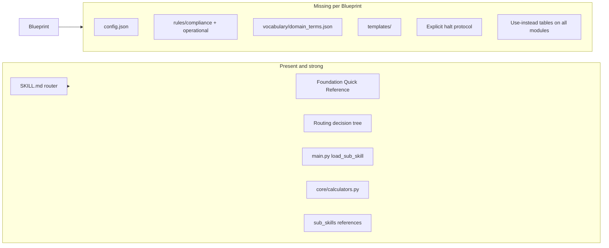

# HK Architect Suite — Blueprint Gap Review

## Assessment summary

[`Claude Desktop/`](Claude%20Desktop/) is correctly positioned as a **Tier 2 professional suite** in [Blueprint & Toolkit](Blueprint%20%26%20Toolkit-%20Creating%20High-Performance%20Claude%20Professional%20Skills.md) (Section 11). It exceeds many blueprint expectations on routing depth and quick-reference design. Gaps cluster into **missing governance scaffolding**, **inconsistent sub-skill metadata**, **dispatcher/calculator bugs**, and **verification/docs drift**.

---

## What already aligns well

| Blueprint requirement | Current state |
|----------------------|---------------|
| Tier 2 tree (`SKILL.md`, `sub_skills/`, `core/`, `main.py`) | Present |
| Master router + quick reference before dispatch | [SKILL.md](Claude%20Desktop/SKILL.md) §1 + §2 |
| Rich `description` with WHAT + WHEN triggers | Master frontmatter lists 15+ trigger domains |
| Master under ~500 lines | ~360 lines — within target |
| Markdown routing + optional Python dispatcher | Decision tree + [`main.py`](Claude%20Desktop/main.py) |
| Progressive disclosure (references one hop away) | 6 modules have `references/`; procurement/plan-of-work are exemplars |
| Quantitative quick-reference tables | OTTV, MOE, plot ratio, NTEH, completion checklist in master |
| Role-based routing index | §2.5 Role Coverage Index (CA, QS, PM, etc.) |
| Third-person sub-skill descriptions | All 41 modules have `name` + `description` YAML |

---

## Potential improvements (by priority)

### P0 — Fix broken or misleading runtime behavior

1. **`hk-minor-works` file path mismatch (dispatcher will fail)**  
   - [`main.py`](Claude%20Desktop/main.py) loads `sub_skills/hk-minor-works/hk-minor-works.md`  
   - Actual file: [`sub_skills/hk-minor-works/hk-minor-work.md`](Claude%20Desktop/sub_skills/hk-minor-works/hk-minor-work.md) (missing `s`)  
   - **Fix:** Rename to `hk-minor-works.md` or add symlink/copy; keep `name:` as `hk-minor-works`.

2. **Egress calculator API mismatch in `main.py`**  
   - `run_hk_calculator` calls `EgressCalculator().calculate(data)` but [`calculators.py`](Claude%20Desktop/core/calculators.py) defines `calculate_remotest_point` only; the working path is `run_calculation()` which is never used from `main.py`.  
   - **Fix:** Route `egress_1004_7` through `run_calculation()` or alias `calculate = calculate_remotest_point`.

3. **`gfa_aggregator` stub vs real implementation**  
   - `main.py` returns `{"msg": "GFA calculation logic ready."}` instead of calling `GFACalculator.aggregate_gfa`.  
   - **Fix:** Wire to `run_calculation("gfa_aggregator", data)`; document JSON schema in `hk-architect-calculator`.

4. **Undocumented calculator: `layout_sort`**  
   - Implemented in `calculators.py` but not listed in [SKILL.md §3](Claude%20Desktop/SKILL.md) or README calculator section.  
   - **Fix:** Add to dispatcher docs or remove if unused.

---

### P1 — Add missing Tier 2 governance layer (Blueprint §§5–6)

Blueprint expects these at suite root; **none exist** in `Claude Desktop/` today:

| Artifact | Purpose | Suggested HK content |
|----------|---------|----------------------|
| [`config.json`](Blueprint%20%26%20Toolkit-%20Creating%20High-Performance%20Claude%20Professional%20Skills.md) | `strict_mode`, jurisdictional bounds, iteration limits | `enforce_jurisdictional_bounds: true`, `target_governance_framework: "BO Cap.123 / PNAP / FS Code 2011"`, `allow_assumptions: false` for statutory conclusions |
| [`rules/compliance.md`](Blueprint%20%26%20Toolkit-%20Creating%20High-Performance%20Claude%20Professional%20Skills.md) | Non-negotiable halts | HK domain pack: not licensed AP/RSE sign-off; cite BO/PNAP when asserting compliance; no invented PNAP clauses; PI/legal advice boundaries; UBW rectification = advisory only |
| [`rules/operational.md`](Blueprint%20%26%20Toolkit-%20Creating%20High-Performance%20Claude%20Professional%20Skills.md) | SOPs | Intake checklist (site, OZP, lease, use class); when to load sub-skill vs Section 1; escalation to human AP; artifact naming (BD submission packs) |
| [`vocabulary/domain_terms.json`](Blueprint%20%26%20Toolkit-%20Creating%20High-Performance%20Claude%20Professional%20Skills.md) | Disambiguate acronyms | GFA, PR, BHR, OZP, PNAP, MOE, FSD, NTEH, MWCS, OTTV, AVA, AP, RSE, PC, DLP, etc. (many appear undefined across modules) |
| [`templates/`](Blueprint%20%26%20Toolkit-%20Creating%20High-Performance%20Claude%20Professional%20Skills.md) | Deterministic deliverables | e.g. compliance memo, stage-gate checklist, tender route recommendation, OP readiness matrix |

Wire these into master `SKILL.md` **Cognitive Workflow** (Blueprint §5): Phase 2 should explicitly `read ./rules/compliance.md` and **hard-stop** on violation; Phase 1 should cross-reference `vocabulary/domain_terms.json`.

---

### P2 — Master `SKILL.md` structure gaps (Blueprint §5)

Current master is strong on quick reference and routing but **omits** several blueprint sections:

- **§1 Identity and Core Mission** — persona/objective/governance frameworks are implied, not stated as a dedicated block (compare blueprint template lines 209–213).
- **§2 Operational Environment** — jurisdiction (HK), stakeholders (BD, PlanD, FSD, LandsD), tools (dispatcher, Plan Mode) should be explicit.
- **§3 Cognitive Workflow** — four-phase ingest → validate → analyze → synthesize with halt branch is absent; only routing tree exists.
- **§5 Universal response constraints** — no global rules for tone (“start with artifact”), uncertainty declaration, or assumption listing.
- **`disable-model-invocation`** — not in frontmatter (Blueprint Tier 1 default `true`; master currently uses ambient “when in doubt, activate” which conflicts with Cursor guidance for selective loading).

**Improvement:** Add compact §§1–2 and §5 to master; keep depth in sub-skills. Decide explicitly: master is **always-on hub** (omit `disable-model-invocation`) vs **triggered skill** (add `disable-model-invocation: true` and strengthen description triggers).

---

### P3 — Sub-skill consistency (Blueprint §4 + Quality Checklist §9)

Only **2 of 41** modules have full **“When to Use / Use instead”** tables ([`hk-procurement-strategy`](Claude%20Desktop/sub_skills/hk-procurement-strategy/hk-procurement-strategy.md), [`hk-plan-of-work`](Claude%20Desktop/sub_skills/hk-plan-of-work/hk-plan-of-work.md)). Blueprint requires this on **every** Tier 2 module to prevent overlap (e.g. `hk-fire-life-safety` vs `hk-construction-health-safety`, `hk-building-codes` vs `hk-minor-works`).

| Pattern | Count | Action |
|---------|-------|--------|
| `user-invocable: true` | ~41 | Good for Claude Desktop; document as platform-specific (not in Cursor blueprint) |
| “Use instead” cross-links | ~3 files | Add §“When to Use This Skill” table to remaining 39 modules (can be 5–8 rows each) |
| `For X, use Y instead` one-liner | procurement only | Standardize at top of each sub-skill per blueprint template |

**Description quality:** Many sub-skill descriptions are single-line and lack **WHEN** trigger phrases (e.g. [`hk-fire-life-safety`](Claude%20Desktop/sub_skills/hk-fire-life-safety/hk-fire-life-safety.md)). Expand to third-person WHAT + WHEN under 1024 chars.

**Halt criteria:** Almost no module documents licensing boundaries, missing site data, or policy conflicts (Blueprint checklist item). Highest-impact homes: `hk-professional-indemnity`, `hk-unauthorised-building-works`, `hk-building-codes`, `hk-spatial-planning`.

---

### P4 — Documentation and activation (Blueprint §8)

- **[README.md](README.md)** says **35** sub-skills; [`main.py`](Claude%20Desktop/main.py) `valid_skills` lists **41** — update counts and Skill Map (missing: `hk-cost-consultancy`, `hk-construction-health-safety`, `hk-project-management`, `hk-deliverables-workstages`, `hk-architect-foundations`, etc.).
- **No golden verification prompts** (Blueprint §8C): add 3–5 test prompts to README or `VERIFICATION.md`:
  1. Routine MOE question → answer from Section 1 only  
  2. NEC4 typhoon EOT → `hk-procurement-strategy` + typhoon reference  
  3. Request to certify OP without inspection → **halt** per compliance rules  
- **Cursor project wiring:** No [`.cursor/rules/`](.cursor/rules/) or `AGENTS.md` activation snippet (Blueprint recommends this for repo users on Cursor).

---

### P5 — Calculator and reference depth

- **`hk-architect-calculator`** documents OTTV/MOE in markdown but **`run_hk_calculator` only supports egress + GFA stub** — align skill prose with dispatcher capabilities or implement OTTV/MOE in `core/`.
- **Egress logic** uses diagonal-of-rectangle vs FS Code “remotest point” path — document limitation in calculator output; avoid presenting as statutory sign-off.
- **Reference coverage:** Only 6/41 modules have `references/` — consider extracting long tables from heavy sub-skills (`hk-tender-contract-administration`, `hk-building-codes`) to keep modules under ~500 lines and one-hop readable.

---

### P6 — Anti-patterns to watch (Blueprint §10)

| Risk | Observation | Mitigation |
|------|-------------|------------|
| Master grows past 500 lines | Quick reference is large but still OK | Move §1.10+ niche tables to `hk-architect-foundations` reference |
| Duplicate guidance | MOE/travel distance in master + `hk-fire-life-safety` + `hk-building-codes` | Master = numbers only; sub-skills = interpretation + edge cases |
| Deep reference chains | Some sub-skills may point to multiple refs | Keep one hop: sub-skill → `references/` only |
| Vague compliance | “Compliant” without OZP/lease check | `rules/compliance.md` + mandatory “verify OZP Notes and lease” halt |

---

## Suggested implementation order

1. **P0** — Fix `hk-minor-works` path + wire calculators correctly (unblocks `load_sub_skill` / `run_hk_calculator`).
2. **P1** — Add `config.json`, `rules/`, `vocabulary/`, link from master cognitive workflow.
3. **P3** — Roll “When to Use / Use instead” tables across sub-skills (batch by cluster: regulatory → delivery → practice ops).
4. **P2** — Master identity, halt protocol, response constraints, `disable-model-invocation` decision.
5. **P4–P5** — README sync, golden tests, templates, reference extraction.

---

## Files most impacted

- [Claude Desktop/SKILL.md](Claude%20Desktop/SKILL.md) — governance hooks, cognitive workflow, response constraints  
- [Claude Desktop/main.py](Claude%20Desktop/main.py) — calculator wiring, path fix validation  
- [Claude Desktop/core/calculators.py](Claude%20Desktop/core/calculators.py) — dispatcher integration  
- [Claude Desktop/sub_skills/hk-minor-works/hk-minor-work.md](Claude%20Desktop/sub_skills/hk-minor-works/hk-minor-work.md) — rename  
- **New:** `Claude Desktop/config.json`, `rules/`, `vocabulary/`, optional `templates/`  
- [README.md](README.md) — accurate skill count + verification prompts  

No code changes in this review pass — implementation awaits your approval.
