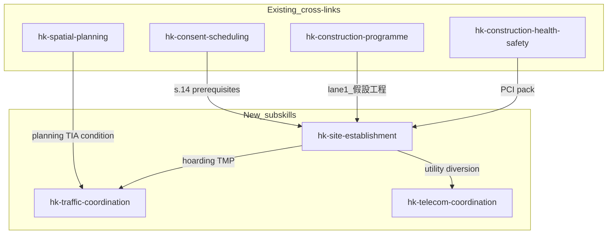
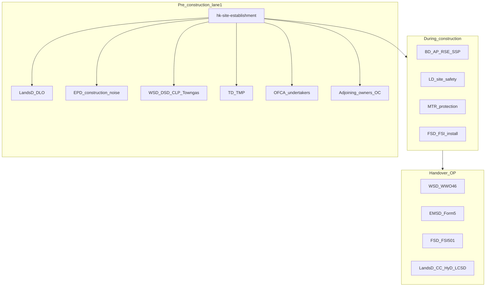

# Add pre-construction, hoarding, TD, and OFCA subskills

**Decision:** User confirmed — gaps should be filled with **three new subskills**, not one monolithic skill. Hoarding stays inside site establishment (it is lane 1 of 假設工程); traffic and telecom are separate authority workflows.

---

## Coverage after implementation

| Topic | New skill | Depth |
|-------|-----------|-------|
| Pre-construction preparation | `hk-site-establishment` | Full mobilisation workflow |
| Hoarding setup | `hk-site-establishment` §3 | Design, permits, TD interface, typhoon |
| Traffic consultants / TD | `hk-traffic-coordination` | TIA, TMP, construction-phase accommodation |
| OFCA | `hk-telecom-coordination` | Licensed works, cable diversion, undertaker liaison |



---

## 1. New subskill — `hk-site-establishment`

**Path:** [`hk-architect-master/subskills/hk-site-establishment/hk-site-establishment.md`](hk-architect-master/subskills/hk-site-establishment/hk-site-establishment.md)

**Description (frontmatter):** Activate for Hong Kong pre-construction and site establishment (假設工程) — mobilisation checklist, hoarding design and permits, temporary works, utility diversion coordination, neighbour liaison, site logistics, PCI pack assembly, and interface to consent (s.14) and construction programme lane 1.

### Proposed sections

| § | Title | Content |
|---|-------|---------|
| 1 | Scope and position | Distinct from `hk-consent-scheduling` (statutory consent timing), `hk-construction-programme` (sequencing), `hk-project-management` (client governance) |
| 2 | Pre-construction readiness gate | Checklist before hoarding/works: approved E&S plans, SSP accepted, contractor appointed, insurance, land conditions, utility records obtained |
| 3 | Hoarding design and permits | Height/setbacks, pedestrian routes, viewing panels, lighting, signage, maintenance access; BD hoarding plan vs land-grant conditions; **clarify hoarding permit is not completion Form BA14** |
| 4 | Temporary works | Site offices, cranes, hoarding gates, shoring interfaces, survey control, dewatering permits |
| 5 | Utility and undertaker liaison | CLP/HKE, WSD, DSD, telecom — diversion applications, protection, record plans; route to `hk-telecom-coordination` for OFCA/licensed works |
| 6 | Authority and neighbour interfaces | LandsD site conditions, EPD noise permit path, neighbour notification, loading/unloading bays |
| 7 | PCI and mobilisation pack | PCI contents for `hk-construction-health-safety`; contractor mobilisation documents |
| 8 | Programme hooks | Align with swimlane lane 1; typical durations; critical path before excavation |
| 9 | Cross-references | `hk-traffic-coordination` for hoarding TMP; `hk-consent-scheduling` for BA8; `hk-site-supervision` for SSP |
| 10 | Output checklist | Practical closeout before lane 2 (excavation) |

**Deep reference:** [`hk-architect-master/references/hk-site-establishment-checklist.md`](hk-architect-master/references/hk-site-establishment-checklist.md) — one-page gate checklist (authorities, undertakers, documents, sign-offs).

**Second reference:** [`hk-architect-master/references/hk-construction-stakeholder-register.md`](hk-architect-master/references/hk-construction-stakeholder-register.md) — full party/authority map by phase (see §1A below); load via `SKILL_REFERENCES` for `hk-site-establishment`.

### §1A — Other parties and authorities (beyond traffic and telecom)

Architects coordinating **successful construction** need a single stakeholder view. Most are **already covered** by existing subskills; the gap is a **consolidated register** in site-establishment, not three more subskills. Group by when they bite:

#### A. Statutory — building control chain (existing skills — cross-link, do not duplicate)

| Party | Construction relevance | Existing skill |
|-------|------------------------|----------------|
| **BD** | Consent (BA8), SSP, site inspections, referrals, OP | `hk-consent-scheduling`, `hk-site-supervision`, `hk-op-submission-strategy` |
| **FSD** | Parallel GBP referral; construction-phase fire precautions; FSI install/commission | `hk-fire-life-safety`, `hk-fsd-licensing-compliance`, `hk-building-services` |
| **AP / RSE / RGE / RC** | Statutory appointments; hold points; certifications | `hk-site-supervision`, `hk-structural-systems` |
| **RPS (Registered Professional Surveyor)** | Height, setbacks, site levels on record plans (BA14 packages) | `hk-consent-scheduling` §8, `hk-op-submission-strategy` |

#### B. Statutory — planning and land (design → site start)

| Party | Construction relevance | Existing skill |
|-------|------------------------|----------------|
| **PlanD / TPB** | s.16 conditions (TIA, AVA, DDA) flow into construction compliance | `hk-spatial-planning`, `hk-concept-design` |
| **LandsD (DLO)** | Lease conditions, hoarding on grant land, MOD/waivers, site formation obligations | `hk-lease-compliance`, `hk-certificate-of-compliance` |
| **URA** | Redevelopment schemes, compensation interfaces, programme constraints | *Light mention only* — extend register; no new subskill unless URA-heavy brief |

#### C. Utility undertakers and infrastructure (lane 1 — high construction risk)

| Party | Construction relevance | Existing skill / plan |
|-------|------------------------|---------------------|
| **WSD** | Temporary supply, mains diversion, fire main, **WWO 46** at handover | `hk-building-services` |
| **DSD** | Storm/foul connection, drainage diversion, **drainage impact assessment** | `hk-building-services`, `hk-spatial-planning` (DIA checklist) |
| **CLP / HKE** | Temporary and permanent power, cable routes, substation rooms | `hk-building-services` |
| **Towngas** | Gas mains protection/diversion if commercial kitchen or district supply | *Gap* — add to stakeholder register + `hk-site-establishment` §5 |
| **OFCA / telecom undertakers** | Licensed works, fibre protection | `hk-telecom-coordination` (new) |
| **TD / HyD** | TMP, highway occupation, Green Area roads at completion | `hk-traffic-coordination` (new), `hk-certificate-of-compliance` |

#### D. Environmental and site operations (often missed until too late)

| Party | Construction relevance | Existing skill |
|-------|------------------------|----------------|
| **EPD** | **Construction Noise Permit** (Noise Control Ordinance Cap. 400); waste disposal; air quality if EIA conditions | `hk-acoustic-design` (noise criteria); *CNP workflow thin* — expand in site-establishment §6 |
| **LD (Labour Department)** | Site safety enforcement; contractor safety plan; accident reporting | `hk-construction-health-safety` |
| **CEDD / GEO** | Slopes, retaining walls, landslip prevention; maintenance responsibility | *Gap* — register + cross-link `hk-structural-systems` / external works |
| **MTR Corp** | Railway protection zones, settlement monitoring, vibration limits above/beside tunnels | `hk-acoustic-design`, `hk-building-typology` (TOD) |

#### E. Licensing and operational authorities (construction → occupation)

| Party | Construction relevance | Existing skill |
|-------|------------------------|----------------|
| **EMSD** | Lifts/escalators **Form 5**; BEC compliance evidence | `hk-building-services`, OP matrix |
| **FEHD** | F&B layout, grease traps, licensing if podium retail; site canteen hygiene | `hk-building-services`, `hk-building-typology` — *no construction-phase FEHD skill* |
| **LCSD** | Handover of open space / recreational assets with Green Area | `hk-certificate-of-compliance` |
| **PPE / assembly licensing** | Places of public entertainment if function rooms, cinemas | `hk-fire-life-safety` (PPE mention) |

#### F. Non-government parties architects must manage on site

| Party | Construction relevance | Existing skill |
|-------|------------------------|----------------|
| **Client / developer** | Instructions, insurance, access to funds, sales programme | `hk-project-management` |
| **Main contractor (RC)** | Mobilisation, method statements, programme, TMP execution | `hk-tender-contract-administration`, `hk-construction-programme` |
| **Subcontractors / specialists** | Façade, piling, ELS, MiC logistics | `hk-mic-dfma`, trade-specific |
| **Adjoining owners / OC / DMC** | Access, noise, vibration, party/common wall, underpinning (A&A) | `hk-alterations-additions` — *expand register for greenfield neighbour liaison* |
| **Management company / IOC** | Existing estate interfaces for A&A; handover to new OC | `hk-practical-completion-snagging`, BMO context in foundations |
| **QS / cost consultant** | Valuations, PC sums, utility diversion allowances | `hk-cost-consultancy` |
| **Insurance (CAR / PI)** | Cover for third-party property, adjacent buildings | `hk-professional-indemnity` |

#### G. Public-sector and typology-specific (route when applicable)

| Party | When | Existing skill |
|-------|------|----------------|
| **HA / HD** | Public housing sites | `hk-building-typology`, `hk-building-programming` |
| **ArchSD / DEVB** | Government works; NEC/GCC contracts | `hk-procurement-strategy`, `hk-tender-contract-administration` |
| **AMO / AAB** | Heritage sites — works near graded fabric | `hk-heritage-conservation` |
| **Marine Department** | Waterfront reclamation / marine works interface | *Not covered* — register note only |



#### Recommendation for this implementation pass

**Do not add more subskills** for the parties above — coverage exists but is fragmented. Instead:

1. **`hk-construction-stakeholder-register.md`** — master table: Party | Phase | Typical trigger | Lead consultant | Architect action | `skill_id` cross-link.
2. **Expand `hk-site-establishment` §6** — rename to *Authority, undertaker, and neighbour interfaces*; include EPD CNP, Towngas, MTR protection check, adjoining-owner protocol, LandsD DLO hoarding conditions.
3. **`hk-site-establishment-checklist.md`** — RAG columns for each party (N/A / pending / cleared).
4. **`domain_terms.json`** — add: `CNP`, `DIA`, `CLP`, `HKE`, `Towngas`, `CEDD`, `GEO`, `DLO`, `OC` (owners corporation), `CNP` construction noise permit.
5. **Optional later subskills** (out of scope unless user requests): `hk-environmental-permits` (EPD CNP/EIA conditions), `hk-adjoining-party-interface` (A&A heavy), `hk-slope-geotechnical` (CEDD/GEO).

**Priority parties most often causing site-start delay** (architect should track explicitly in site-establishment):

1. LandsD DLO — hoarding and lease compliance  
2. EPD — construction noise permit before piling/night works  
3. WSD / DSD / CLP-HKE — diversion lead times  
4. MTR — protection and monitoring if within influence zone  
5. Adjoining owners — access and damage claims  
6. LD — safety plan acceptance (contractor-led but architect reviews PCI)  
7. BD referral cycle — FSD/WSD/DSD comments on E&S consent package  

---

## 2. New subskill — `hk-traffic-coordination`

**Path:** [`hk-architect-master/subskills/hk-traffic-coordination/hk-traffic-coordination.md`](hk-architect-master/subskills/hk-traffic-coordination/hk-traffic-coordination.md)

**Description:** Activate for Hong Kong traffic consultant appointment, Traffic Impact Assessment (TIA), Temporary Traffic Management Plan (TMP), Transport Department (TD) and Highways Department (HyD) submissions, construction-phase traffic accommodation, bus stop / loading bay impacts, and lane-closure coordination.

### Proposed sections

| § | Title | Content |
|---|-------|---------|
| 1 | Scope | Planning-stage TIA vs construction-stage TMP; TD vs HyD split |
| 2 | When to engage | s.16 planning conditions (`hk-spatial-planning`); hoarding/haul routes (`hk-site-establishment`); MiC module transport (`hk-mic-dfma`) |
| 3 | Traffic consultant scope | Deliverables, fee basis (`hk-fee-proposal-strategy` §8), RACI with architect/PM |
| 4 | TIA (planning) | Triggers, methodology, mitigation (access, parking, pedestrian), PlanD/TPB interface |
| 5 | TMP (construction) | Hoarding egress, crane lifts, concrete pours, night works, emergency access |
| 6 | TD submission workflow | Application types, drawings required, review cycles, conditions compliance |
| 7 | HyD interface | Public highway vs private access; Green Area handover link to `hk-certificate-of-compliance` |
| 8 | Programme and risk | Typical lead times; typhoon/T8 stand-down; interface with lane 1 and lane 4 |
| 9 | Output checklist | Pre-start traffic sign-off |

**Deep reference:** [`hk-architect-master/references/hk-td-submission-types.md`](hk-architect-master/references/hk-td-submission-types.md) — table of submission types (TIA, TMP, lane occupation, bus stop relocation) with typical authority and lead time.

---

## 3. New subskill — `hk-telecom-coordination`

**Path:** [`hk-architect-master/subskills/hk-telecom-coordination/hk-telecom-coordination.md`](hk-architect-master/subskills/hk-telecom-coordination/hk-telecom-coordination.md)

**Description:** Activate for Office of the Communications Authority (OFCA) and licensed telecommunications works in Hong Kong — cable/fibre protection and diversion, utility undertaker coordination, excavation near telecom plant, record drawings, and BD referral interfaces during site establishment and construction.

### Proposed sections

| § | Title | Content |
|---|-------|---------|
| 1 | Scope | OFCA vs EMSD vs CLP/HKE — do not conflate electrical and telecom |
| 2 | When triggered | New development, basement excavation, road opening, hoarding over plant, utility diversion in lane 1 |
| 3 | Licensed works framework | Undertakers, protection notices, diversion agreements (high-level — verify live OFCA/undertaker circulars) |
| 4 | Site establishment interface | Record search, trial holes, protection before hoarding/piling; link `hk-site-establishment` §5 |
| 5 | Construction coordination | Diversion sequencing with excavation (`hk-construction-programme`); as-built records |
| 6 | BD and referral context | Utility plans in GBP referral; separate undertaker approvals |
| 7 | Risk hotspots | Unrecorded plant, service strikes, programme float, handover records |
| 8 | Cross-references | `hk-certificate-of-compliance` for external works closeout |
| 9 | Output checklist | Pre-excavation telecom clearance |

**Deep reference:** [`hk-architect-master/references/hk-ofca-licensed-works.md`](hk-architect-master/references/hk-ofca-licensed-works.md) — undertaker contact workflow, protection vs diversion decision tree, document register.

**Compliance note:** Skill must include halt rule — do not certify undertaker approval status without live confirmation; cite need to verify current OFCA codes and undertaker requirements.

---

## 4. Integration — [`SKILL.md`](hk-architect-master/SKILL.md)

Add routing branches (after consent / before site supervision block):

```
├─ Pre-construction, site establishment (假設工程), hoarding, temporary works, utility diversion, neighbour liaison, or mobilisation checklist?
│   └─► [hk-site-establishment]  (+ hk-consent-scheduling for BA8; hk-construction-health-safety for PCI)
│
├─ Traffic consultant, TIA, TMP, Transport Department (TD), lane closure, bus stop, or construction traffic accommodation?
│   └─► [hk-traffic-coordination]  (+ hk-spatial-planning if planning-condition TIA; hk-site-establishment if hoarding TMP)
│
├─ OFCA, telecommunications, fibre/cable diversion, licensed works, or utility undertaker telecom protection?
│   └─► [hk-telecom-coordination]  (+ hk-site-establishment for lane-1 sequencing)
```

**Multi-skill priority** — extend Delivery chain:

`… › hk-construction-programme › **hk-site-establishment** › **hk-traffic-coordination** › **hk-telecom-coordination** › hk-procurement-strategy …`

**Subskill list** (§ end of SKILL.md): append the three new `skill_id` values.

**Role coverage index:** Add rows under Designer / PM for site establishment and specialist coordination duties.

---

## 5. Integration — [`scripts/dispatcher.py`](hk-architect-master/scripts/dispatcher.py)

Add to `VALID_SKILLS`:

- `hk-site-establishment`
- `hk-traffic-coordination`
- `hk-telecom-coordination`

Add to `SKILL_REFERENCES`:

```python
"hk-site-establishment": [
    "hk-site-establishment-checklist.md",
    "hk-construction-stakeholder-register.md",
],
"hk-traffic-coordination": ["hk-td-submission-types.md"],
"hk-telecom-coordination": ["hk-ofca-licensed-works.md"],
```

No change needed in [`hk_architect_skills/dispatcher.py`](hk_architect_skills/dispatcher.py) — it re-exports from master scripts.

---

## 6. Cross-links in existing skills (minimal diffs)

| File | Change |
|------|--------|
| [`hk-consent-scheduling`](hk-architect-master/subskills/hk-consent-scheduling/hk-consent-scheduling.md) §2.1 | Fix "Form BA14/14A" hoarding wording → hoarding/scaffolding **approval per BD/land conditions**; cross-link `hk-site-establishment` for hoarding design |
| [`hk-construction-programme`](hk-architect-master/subskills/hk-construction-programme/hk-construction-programme.md) §3 | Add routing note: lane 1 detail → `hk-site-establishment` |
| [`hk-construction-sequence-swimlanes.md`](hk-architect-master/references/hk-construction-sequence-swimlanes.md) lane 1 | Change skill pointer from `hk-project-management` to `hk-site-establishment` |
| [`hk-spatial-planning`](hk-architect-master/subskills/hk-spatial-planning/hk-spatial-planning.md) §6 checklist | TIA line → `hk-traffic-coordination` for execution |
| [`hk-fee-proposal-strategy`](hk-architect-master/subskills/hk-fee-proposal-strategy/hk-fee-proposal-strategy.md) §8 | Traffic specialist → `hk-traffic-coordination`; add telecom/OFCA row |
| [`hk-mic-dfma`](hk-architect-master/subskills/hk-mic-dfma/hk-mic-dfma.md) §4 | TMP → `hk-traffic-coordination` |
| [`hk-construction-health-safety`](hk-architect-master/subskills/hk-construction-health-safety/hk-construction-health-safety.md) §7 | PCI assembly → `hk-site-establishment` |

---

## 7. [`domain_terms.json`](hk-architect-master/references/domain_terms.json)

Add entries:

| Term | Definition |
|------|------------|
| `TD` | Transport Department — traffic impact and temporary traffic management for public roads |
| `TIA` | Traffic Impact Assessment — planning-stage traffic study, often s.16 condition |
| `TMP` | Temporary Traffic Management Plan — construction-phase traffic accommodation |
| `OFCA` | Office of the Communications Authority — telecom licensing and undertaker regulation |
| `假設工程` | Site establishment works — hoarding, utilities, survey, mobilisation before main works |
| `PCI` | Pre-construction information — H&S information pack for contractor mobilisation |
| `CNP` | Construction Noise Permit — EPD approval under Noise Control Ordinance for prescribed construction activities |
| `DIA` | Drainage Impact Assessment — DSD consultation for development drainage effects |
| `DLO` | District Lands Office — LandsD front door for site conditions and grant compliance |
| `CLP` | CLP Power — electricity supply undertaker (Kowloon and New Territories) |
| `HKE` | Hongkong Electric — electricity supply undertaker (Hong Kong Island and Lamma) |

---

## 8. Evals — [`evals/evals.json`](hk-architect-master/evals/evals.json)

Add three routing evals:

1. **Hoarding before excavation** — expects `hk-site-establishment`, hoarding + consent prerequisites, not OP BA14.
2. **TD TMP for crane lift over carriageway** — expects `hk-traffic-coordination`, cross-link site-establishment.
3. **OFCA cable diversion for basement excavation** — expects `hk-telecom-coordination`, undertaker protection workflow.

---

## 9. Subskill file template (follow existing convention)

Each new file uses the same frontmatter pattern as [`hk-mic-dfma`](hk-architect-master/subskills/hk-mic-dfma/hk-mic-dfma.md):

- `name`, `description`, `disable-model-invocation: true`
- "When to Use This Skill" routing table with Use instead column
- Numbered sections, tables, practical checklist, sources footnote
- No invented PNAP clause numbers — use "verify live circular" where statutory detail is uncertain

---

## 10. Out of scope (this pass)

- Architect Desk-HK app integration
- New calculators
- Separate `hk-hoarding` subskill (folded into site-establishment)
- Deep legal text on OFCA licensing — high-level workflow only with verification halt

---

## Implementation order

1. Create three reference markdown files (checklists are loadable via dispatcher)
2. Create three subskill markdown files
3. Update dispatcher `VALID_SKILLS` + `SKILL_REFERENCES`
4. Update `SKILL.md` router, index, role table
5. Cross-link existing skills (small edits)
6. Update `domain_terms.json`
7. Add evals
8. Smoke test: `python hk-architect-master/main.py` load each new `skill_id`
