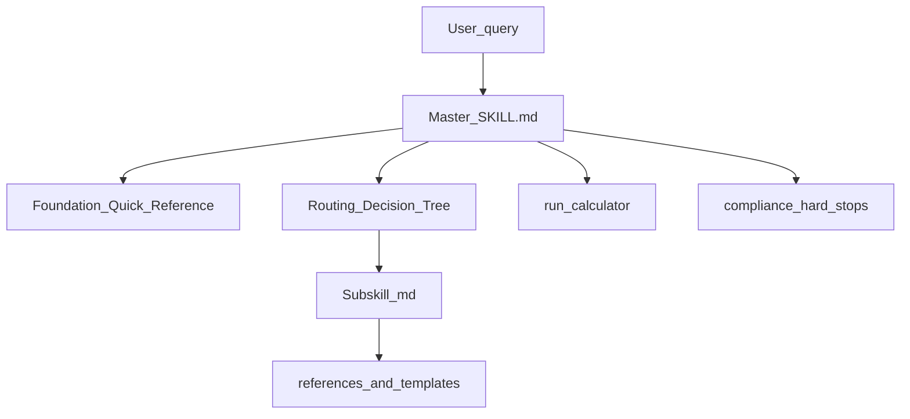

# Architect Skill Blueprint Reference

> **Purpose:** Jurisdiction-neutral topic taxonomy and localization blueprint derived from the Hong Kong Architect Master Suite (`hk-architect-master` v2.1.0). Use this document when building equivalent architect skill suites for other countries (e.g. UK, Mainland China, Saudi Arabia).
>
> **Source:** [`hk-architect-master/SKILL.md`](../hk-architect-master/SKILL.md) and 45 subskills under [`hk-architect-master/subskills/`](../hk-architect-master/subskills/)
>
> **Date:** July 2026
>
> **How to use:** This is **not** statutory content for any jurisdiction. It documents *what topics* a full architect practice skill suite should cover, *how* the HK suite is structured, and *what to replace* when localizing. HK values appear only as provenance examples in Part E.

---

## Table of Contents

1. [Part A — Suite Architecture Pattern](#part-a--suite-architecture-pattern)
2. [Part B — Topic Taxonomy (10 Clusters, 45 Subskills)](#part-b--topic-taxonomy-10-clusters-45-subskills)
3. [Part C — Master Quick-Reference Topic Map](#part-c--master-quick-reference-topic-map)
4. [Part D — Shared Infrastructure Topics](#part-d--shared-infrastructure-topics)
5. [Part E — Localization Blueprint (UK / Mainland China / Saudi)](#part-e--localization-blueprint-uk--mainland-china--saudi)
6. [Part F — Role-to-Skill Mapping Template](#part-f--role-to-skill-mapping-template)
7. [Part G — Implementation Checklist for New Country Suites](#part-g--implementation-checklist-for-new-country-suites)

---

# Part A — Suite Architecture Pattern

## A.1 High-level flow

## A.2 Repository layout (reusable pattern)

| Path | Role |
|------|------|
| `{country}-architect-master/SKILL.md` | Master hub: identity, quick reference, routing tree, role index, tool definitions |
| `{country}-architect-master/subskills/{slug}/{slug}.md` | Deep domain instructions (one skill per folder) |
| `{country}-architect-master/references/config.json` | Jurisdiction bounds, strict mode, governance framework list |
| `{country}-architect-master/references/compliance.md` | Hard-stop rules, licensing boundaries |
| `{country}-architect-master/references/operational.md` | Intake checklist, routing SOP, escalation table |
| `{country}-architect-master/references/domain_terms.json` | Acronym and term glossary |
| `{country}-architect-master/references/*.md` | Deep-reference files (workstages, procurement, swimlanes, checklists) |
| `{country}-architect-master/references/templates/` | Standard deliverable shells |
| `{country}-architect-master/scripts/calculators.py` | Deterministic calculations |
| `{country}-architect-master/scripts/dispatcher.py` | Subskill loader |
| `{country}-architect-master/evals/evals.json` | Routing and halt-behavior evals |

## A.3 Master hub design decisions

### Master as mandatory router

- Answer **routine lookups** from Foundation Quick Reference (§1) without loading subskills.
- **Dispatch** to exactly one primary subskill when depth, edge cases, or multi-step workflows are needed.
- Add **secondary** subskills only when topics explicitly overlap (see multi-skill priority below).

### Four-phase cognitive workflow

| Phase | Action | On failure |
|-------|--------|------------|
| **1. Ingestion** | Isolate parameters, constraints, implicit goals; cross-reference glossary and config; list missing high-risk variables | Document gaps before proceeding |
| **2. Compliance** | Apply compliance.md and operational.md | **Hard stop** — cite rule, list gaps, offer remedial options |
| **3. Analysis** | Answer from quick reference or load subskill; run calculators only for supported types | State calculator limitations |
| **4. Synthesis** | Match templates when user requests standard deliverables; declare assumptions | No filler or non-compliant synthesis |

### Multi-skill priority (when topics overlap)

1. **Regulatory:** building-codes › spatial-planning › fire-life-safety › accessibility › minor-works › consent-scheduling › alterations-additions › lease-compliance
2. **Performance:** building-sustainability › building-envelope › daylighting-design › acoustic-design
3. **Typology / programme:** building-typology › building-programming › building-services
4. **Delivery:** concept-design › construction-documentation › plan-of-work › construction-programme › site-establishment › procurement-strategy › tender-contract-administration › cost-consultancy › project-management › deliverables-workstages › (practice management skills)
5. **Site safety:** construction-health-safety › site-supervision › fire-life-safety
6. **Theory:** design-theory › architect-foundations

### Universal response constraints

- **Tone:** Technical, objective, precise; no platitudes.
- **Uncertainty:** State information gaps; document assumptions; never invent code clauses or lease terms.
- **Licensing:** Advisory only — do not sign, certify, or imply statutory approval.
- **Site specificity:** Never state "compliant" without verifying planning zone notes, land title/lease conditions, and site-specific authority comments.

### Intake checklist (before deep analysis)

Confirm or explicitly list as missing:

1. **Site** — address, lot boundaries, existing building status (new build / alterations / unauthorised works context)
2. **Planning** — zone, notes, explanatory statement, prior application history
3. **Land** — title/lease conditions, waivers, compliance certificate pathway if private land
4. **Use and massing** — domestic / non-domestic / mixed; target storeys; height restriction
5. **Procurement / role** — client type, contract form, whether user acts as registered professional, lead consultant, contract administrator, or QS
6. **Stage** — plan-of-work stage 0–7 or statutory submission phase

### Escalation table (neutral pattern)

| Situation | Escalate to |
|-----------|-------------|
| Novel code / authority interpretation | Registered architect + specialist consultant |
| Planning objection risk | Planning consultant |
| Contract claim / EOT quantum | Contract administrator + legal |
| PI incident or coverage dispute | Firm risk manager + insurance broker |
| Enforcement order on non-compliant works | Registered professional + building surveyor with authority liaison |

---

# Part B — Topic Taxonomy (10 Clusters, 45 Subskills)

Each subskill entry includes: **purpose**, **triggers**, **section outline**, **key outputs**, **hard-stops**, **secondary cross-links**, and **localization fields** (what a new country suite must replace).

---

## Cluster 1 — Regulatory & Statutory Compliance (10 subskill entries)

**Cluster purpose:** Primary building legislation, planning control, land/lease alignment, works commencement, minor works, existing-building pathways, and enforcement on non-compliant works.

**Typical triggers:** GFA, plot ratio, site coverage, height restriction, planning application, lease waiver, consent to commence, minor works classification, alterations to existing building, unauthorised works order.

**Localization fields (cluster):** Primary building act and regulations; planning ordinance and zoning maps; land registry / lease authority; registered professional roles; commencement consent regime; minor works control system; enforcement powers on illegal structures.

---

### `hk-building-codes` *(provenance: HK)*

| Field | Detail |
|-------|--------|
| **Purpose** | Deep expertise on primary building legislation: GFA definition, plot ratio, means of escape, fire code cross-reference, barrier-free access summary, PNAP index |
| **Triggers** | BO Cap. 123, PNAP, GFA calculation, plot ratio, site coverage, BHR, MOE travel distance, exit width, sprinkler thresholds |
| **Sections** | 1. Key provisions; 2. GFA calculation; 3. Means of escape; 4. Fire safety (FS Code); 5. Barrier-free access; 6. PNAP reference index |
| **Key outputs** | GFA aggregation tables; MOE compliance memos; exemption schedules; code citation memos |
| **Hard-stops** | Unknown OZP/lease for massing conclusion; cannot certify without site-specific verification |
| **Secondary** | `hk-fire-life-safety`, `hk-accessibility-design`, `hk-spatial-planning`, `hk-architect-calculator` |
| **Localize** | Building act + regs; practice notes for registered professionals; GFA/non-accountable area policy; MOE tables; fire code reference |

---

### `hk-spatial-planning`

| Field | Detail |
|-------|--------|
| **Purpose** | Statutory planning framework, zoning parameters, planning applications, air ventilation assessment, urban design guidelines, development control checklist |
| **Triggers** | OZP zoning, HKPSG, s.16/s.12A application, AVA, TPB, development parameters, view corridors |
| **Sections** | 1. Statutory framework; 2. OZP zones & default parameters; 3. Planning applications (permission, amendment, conditions); 4. Air ventilation assessment; 5. Urban design guidelines; 6. Development control checklist |
| **Key outputs** | Planning parameter tables; AVA scope memos; s.16 submission checklists; condition compliance trackers |
| **Hard-stops** | Halt if OZP Notes unknown for compliance conclusion |
| **Secondary** | `hk-building-codes`, `hk-lease-compliance`, `hk-concept-design`, `hk-traffic-coordination` |
| **Localize** | Planning ordinance; zoning plan system; planning standards manual; ventilation/wind studies; urban design code |

---

### `hk-lease-compliance`

| Field | Detail |
|-------|--------|
| **Purpose** | Land department lease conditions, master layout plans, lease modifications, waivers, three-tier alignment (lease / planning / building) |
| **Triggers** | LandsD, lease GFA cap, MLP, MOD, waiver, parking under lease, SBD lease conditions |
| **Sections** | 1. Three-tiered regulatory framework; 2. Lease modification & waiver types; 3. Key lease restrictions vs planning/building; 4. LandsD submission workflow; 5. Technical coordination checklists; 6. Terms & acronyms |
| **Key outputs** | Lease vs OZP vs BO reconciliation memos; MLP submission packs; waiver application scopes |
| **Hard-stops** | Lease GFA may cap below planning — never assume planning alone governs |
| **Secondary** | `hk-spatial-planning`, `hk-building-codes`, `hk-certificate-of-compliance` |
| **Localize** | Land registry; ground lease / land grant conditions; modification-of-lease process; title restrictions |

---

### `hk-minor-works`

| Field | Detail |
|-------|--------|
| **Purpose** | Minor works control system: classification (Class I–III), professional requirements, common items, submission workflow, technical guidelines |
| **Triggers** | MWCS, MW01/MW03/MW05 forms, APP-147, RMWC, exempted minor works |
| **Sections** | 1. Classification & professional requirements; 2. Common minor works items; 3. Statutory submission workflow; 4. Technical guidelines; 5. Reference materials |
| **Key outputs** | Minor works pathway decision trees; notification form checklists; scope letters for RMWC |
| **Hard-stops** | Works exceeding minor works limits must route to full building approval |
| **Secondary** | `hk-alterations-additions`, `hk-building-codes`, `hk-construction-documentation` |
| **Localize** | Minor works regulation; contractor registration tiers; notification vs approval thresholds |

---

### `hk-alterations-additions`

| Field | Detail |
|-------|--------|
| **Purpose** | Alterations and additions to existing buildings: regulatory pathways (full approval vs minor works), structural/GFA, fire upgrades, coordination |
| **Triggers** | A&A works, existing building retrofit, fire upgrade on alteration, composite use change in existing shell |
| **Sections** | 1. Regulatory pathways: A&A vs minor works; 2. Structural & GFA considerations; 3. Fire safety upgrades; 4. Coordination & management; 5. PNAP reference index for A&A |
| **Key outputs** | Pathway recommendation memos; fire upgrade scope for existing buildings; phased A&A programmes |
| **Hard-stops** | Existing unauthorised works may block approval — cross-check UBW skill |
| **Secondary** | `hk-minor-works`, `hk-building-codes`, `hk-fire-life-safety`, `hk-unauthorised-building-works` |
| **Localize** | Existing-building amendment regime; grandfathering rules; disproportionate upgrade triggers |

---

### `hk-unauthorised-building-works`

| Field | Detail |
|-------|--------|
| **Purpose** | Identification, classification, enforcement orders, rectification/regularization, implications for sale, occupation, and consent |
| **Triggers** | UBW, BD s.24/s.25 order, illegal structure, regularization, OP blocked by UBW |
| **Sections** | 1. Scope and definition; 2. Identification and screening; 3. BD orders and statutory response; 4. Enforcement risk; 5. Rectification strategies; 6. Sale/OP/consent implications; 7. Advising protocol |
| **Key outputs** | UBW screening checklists; regularization pathway memos; risk letters for transactions |
| **Hard-stops** | Do not guarantee legalization outcome; halt certification requests without inspection evidence |
| **Secondary** | `hk-alterations-additions`, `hk-op-submission-strategy`, `hk-building-codes` |
| **Localize** | Enforcement ordinance sections; amnesty/regularization schemes; title search implications |

---

### `hk-consent-scheduling`

| Field | Detail |
|-------|--------|
| **Purpose** | Consent to commence works, fast-track processing, concurrent approval, statutory timelines, renewal, electronic submission, programming from approval to site start |
| **Triggers** | s.14 consent, APP-97 fast-track, ADM-019 concurrent consent, ESH, BA14 completion, record plan, minor deviations |
| **Sections** | 1. Statutory timelines; 2. Consent prerequisites; 3. Fast-track processing; 4. Project programming (road to site start); 5. Electronic submission hub; 6. Renewal strategies; 7. Completion certification; 8. Record plan & minor deviations; 9. ESH protocol |
| **Key outputs** | Consent readiness checklists; programming Gantt assumptions; renewal application scopes |
| **Hard-stops** | Cannot commence without valid consent; record-plan-only zone criteria must be verified |
| **Secondary** | `hk-site-establishment`, `hk-construction-documentation`, `hk-site-supervision` |
| **Localize** | Commencement notice / building permit; electronic portal; fast-track programmes; completion certificate forms |

---

### `hk-certificate-of-compliance`

| Field | Detail |
|-------|--------|
| **Purpose** | Private land grant compliance certificate, consent to assign, green area / infrastructure handover to government departments |
| **Triggers** | CC, Consent to Assign, green area handover, HyD/LCSD coordination on private developments |
| **Sections** | 1. Core position; 2. What CC means; 3. Trigger conditions in private grants; 4. Green area handover; 5. End-to-end process; 6. Document control; 7. Risk hotspots; 8. Mitigation checklist; 9. Output checklist |
| **Key outputs** | CC readiness matrices; handover schedules for public facilities; department liaison trackers |
| **Hard-stops** | CC is separate from occupation permit — do not conflate |
| **Secondary** | `hk-lease-compliance`, `hk-spatial-planning`, `hk-practical-completion-snagging` |
| **Localize** | Subdivision consent; infrastructure dedication; authority acceptance of public realm |

---

### `hk-accessibility-design`

| Field | Detail |
|-------|--------|
| **Purpose** | Barrier-free access: dimensional requirements, tactile paving, submission requirements, public transport interface |
| **Triggers** | DMBA, APP-152, accessible route, ramp gradient, lift size, tactile paving, MTR interface |
| **Sections** | 1. Key dimensional requirements; 2. Tactile paving; 3. BD submission requirements; 4. MTR/public transport interface; 5. Anti-patterns |
| **Key outputs** | Accessible route diagrams; ramp schedules; tactile paving layouts; compliance dimension tables |
| **Hard-stops** | Halt if use class or public interface extent unknown |
| **Secondary** | `hk-building-codes`, `hk-building-typology`, `hk-construction-documentation` |
| **Localize** | National accessibility design manual; equivalent PNAP; transport authority interface standards |

*Note: Also listed under Cluster 2 for performance overlap; regulatory routing takes priority for statutory compliance questions.*

---

### `hk-architect-foundations`

| Field | Detail |
|-------|--------|
| **Purpose** | Auto-activated broad overview: architect references, quantitative rules of thumb, typology taxonomy, routing map before specialist dispatch |
| **Triggers** | "Which skill handles this?", broad HK practice overview, PNAP index, regulatory map |
| **Sections** | 1. Architect & theorist reference table; 2. Quantitative rules of thumb; 3. Typology taxonomy; 4. Regulatory map; 5. Routing table |
| **Key outputs** | Routing recommendations; rules-of-thumb tables; typology classification |
| **Hard-stops** | Deep code questions must route to specialist — foundations is not a substitute |
| **Secondary** | All clusters (routing only) |
| **Localize** | Local architect canon; national planning/building metrics; typology vocabulary for the jurisdiction |

---

## Cluster 2 — Life Safety & Performance (6 subskills)

**Cluster purpose:** Fire and life safety, accessibility performance, acoustic, daylight, sustainability/green rating, and building envelope thermal/wind performance.

**Typical triggers:** Means of escape strategy, sprinkler design, BEAM Plus, OTTV, noise ordinance, daylight factor, curtain wall typhoon load.

**Localization fields (cluster):** Fire code; accessibility manual; environmental noise standards; green building rating tool; wind/thermal codes; climate zone designation.

---

### `hk-fire-life-safety`

| Field | Detail |
|-------|--------|
| **Purpose** | Fire strategy: means of escape, staircases, sprinklers, compartmentation, fire services installations, HK high-rise anti-patterns |
| **Triggers** | FS Code 2011, MOE, scissor stairs, smoke control, pressurisation, FSD approval, compartment wall |
| **Sections** | 1. Means of escape; 2. Staircases; 3. Sprinkler requirements; 4. Fire compartmentation; 5. Fire services installations; 6. HK-specific anti-patterns |
| **Key outputs** | Fire strategy narratives; travel distance tables; sprinkler trigger memos; compartmentation schedules |
| **Hard-stops** | Novel FS Code interpretation → escalate to AP + fire consultant |
| **Secondary** | `hk-building-codes`, `hk-fsd-licensing-compliance`, `hk-building-services` |
| **Localize** | Fire safety code; fire authority approval process; high-rise fire provisions |

---

### `hk-acoustic-design`

| Field | Detail |
|-------|--------|
| **Purpose** | Environmental noise criteria, railway/aircraft noise, BEAM Plus acoustic credits, construction noise permits, internal separation |
| **Triggers** | EPD noise, MTR vibration, aircraft noise, EIAO, construction noise permit Cap.400, STC ratings |
| **Sections** | 1. Environmental noise criteria; 2. Railway noise; 3. Aircraft noise; 4. BEAM Plus IEQ acoustic credits; 5. Construction noise; 6. Internal acoustic separation |
| **Key outputs** | Noise assessment scopes; facade acoustic specifications; construction noise permit checklists |
| **Hard-stops** | Halt if noise source category unknown for criteria selection |
| **Secondary** | `hk-building-envelope`, `hk-spatial-planning`, `hk-construction-health-safety` |
| **Localize** | Environmental noise ordinance; transport noise standards; construction noise permit regime |

---

### `hk-daylighting-design`

| Field | Detail |
|-------|--------|
| **Purpose** | Statutory minimum daylight, green-rating daylight credits, solar geometry, urban canyon, shading strategies |
| **Triggers** | BO Reg.30 daylight, BEAM Plus IEQ daylight, daylight factor, E/W shading, urban canyon |
| **Sections** | 1. BO minimum daylight compliance; 2. BEAM Plus IEQ daylight credits; 3. Solar geometry; 4. Urban canyon context; 5. Shading strategies |
| **Key outputs** | Daylight compliance schedules; shading device specifications; credit targeting memos |
| **Hard-stops** | Site latitude and obstruction context required for simulation scope |
| **Secondary** | `hk-building-envelope`, `hk-building-sustainability`, `hk-architect-calculator` |
| **Localize** | Minimum daylight regulation; latitude-specific solar data; urban context assessment methods |

---

### `hk-building-sustainability`

| Field | Detail |
|-------|--------|
| **Purpose** | Green building rating (NB, EB, Interiors, Neighbourhood), OTTV/RTTV, energy code, climate-responsive strategies, stage integration |
| **Triggers** | BEAM Plus, green building credits, OTTV target, EIA, podium greenery, energy code BEC |
| **Sections** | 1. BEAM Plus overview (categories, rating levels); 2. OTTV & RTTV; 3. Climate-responsive strategies; 4. Energy code; 5. Design integration by stage |
| **Key outputs** | Credit targeting registers; sustainability design briefs; EIA scoping memos |
| **Hard-stops** | Rating tool version must be confirmed |
| **Secondary** | `hk-building-envelope`, `hk-material-selection`, `hk-daylighting-design` |
| **Localize** | National green building rating; energy efficiency code; EIA trigger thresholds |

---

### `hk-building-envelope`

| Field | Detail |
|-------|--------|
| **Purpose** | Facade thermal performance, glazing strategy, typhoon wind loading, curtain wall practice, roof, marine durability |
| **Triggers** | OTTV optimisation, curtain wall, HKWC wind load, WWR, cladding durability, typhoon |
| **Sections** | 1. OTTV & RTTV targets (formula); 2. Glazing strategy; 3. Typhoon wind loading; 4. Curtain wall practice; 5. Roof; 6. Durability (marine exposure) |
| **Key outputs** | Facade performance specifications; wind load interface notes; glazing schedule with SHGC/U-value |
| **Hard-stops** | Wind code edition and exposure category must be stated |
| **Secondary** | `hk-building-sustainability`, `hk-structural-systems`, `hk-material-selection` |
| **Localize** | Wind code; thermal transmittance methodology; facade system testing standards |

---

### `hk-accessibility-design`

*(See Cluster 1 entry — route here for performance-depth on accessible design beyond statutory minimums.)*

---

## Cluster 3 — Design & Technical Systems (7 subskills)

**Cluster purpose:** Concept through documentation, structural and services coordination, space programming, materials, and design theory.

**Typical triggers:** Massing study, BD submission drawings, structural grid, HVAC strategy, area schedule, material spec, design philosophy.

**Localization fields (cluster):** Submission drawing standards; structural codes; MEP codes; national material standards; design culture references.

---

### `hk-concept-design`

| Field | Detail |
|-------|--------|
| **Purpose** | Concept design process: submission stages, OZP massing constraints, urban design drivers, typology vocabulary, green rating at concept, TOD integration |
| **Triggers** | Massing strategy, BHR compliance, schematic design for submission, podium-tower, AVA at concept |
| **Sections** | 1. BD submission stages; 2. OZP massing constraints; 3. Urban design drivers; 4. HK typology vocabulary; 5. BEAM Plus at concept; 6. MTR TOD concept integration |
| **Key outputs** | Concept design reports; massing option comparisons; urban design compliance matrices |
| **Hard-stops** | BHR and lease must be confirmed before massing sign-off |
| **Secondary** | `hk-spatial-planning`, `hk-building-typology`, `hk-design-theory` |
| **Localize** | Local design stage gates; planning design guidance; transit-oriented development norms |

---

### `hk-construction-documentation`

| Field | Detail |
|-------|--------|
| **Purpose** | Statutory submission workflow, drawing set requirements, PNAP administrative refs, specification standards, minor works regime |
| **Triggers** | GBP submission, AP/RSE/RC appointments, GS specification, BD drawing requirements, OP process |
| **Sections** | 1. BD statutory submission workflow; 2. Drawing set requirements; 3. PNAP administrative references; 4. Specification standards; 5. Minor works regime |
| **Key outputs** | Submission index sheets; drawing checklist by stage; specification section outlines |
| **Hard-stops** | AP/RSE signature boundary — offer checklist only |
| **Secondary** | `hk-consent-scheduling`, `hk-deliverables-workstages`, `hk-minor-works` |
| **Localize** | Authority drawing standards; registered professional appointment rules; national specification systems |

---

### `hk-structural-systems`

| Field | Detail |
|-------|--------|
| **Purpose** | Lateral design, structural grids, transfer slabs, floor systems, foundations, concrete specification |
| **Triggers** | SUC 2013, HKWC, transfer slab, diaphragm, pile foundation, lateral system, wind + seismic |
| **Sections** | 1. Lateral design; 2. Structural grid norms; 3. Transfer slab; 4. Floor systems; 5. Foundations; 6. Concrete specification |
| **Key outputs** | Grid coordination memos; transfer slab design briefs; foundation type recommendations |
| **Hard-stops** | Geotechnical input required for foundation conclusions |
| **Secondary** | `hk-building-envelope`, `hk-concept-design`, `hk-mic-dfma` |
| **Localize** | Structural concrete/steel codes; wind/seismic maps; typical grid dimensions for local construction |

---

### `hk-building-services`

| Field | Detail |
|-------|--------|
| **Purpose** | HVAC, electrical, plumbing, drainage, fire services coordination, environmental compliance |
| **Triggers** | CoP EE HVAC, HK Wiring Regulations, WSD plumbing, DSD drainage, FSD installations, EPD discharge |
| **Sections** | 1. HVAC; 2. Electrical; 3. Plumbing & water supply; 4. Drainage; 5. FSD coordination; 6. EPD compliance |
| **Key outputs** | Services coordination drawings briefs; load schedules; authority referral lists |
| **Hard-stops** | Undertaker capacity confirmations for large developments |
| **Secondary** | `hk-fire-life-safety`, `hk-building-sustainability`, `hk-fsd-licensing-compliance` |
| **Localize** | MEP codes; utility undertaker standards; fire services installation requirements |

---

### `hk-material-selection`

| Field | Detail |
|-------|--------|
| **Purpose** | Green rating materials credits, marine/subtropical durability, regional sourcing, typhoon resistance, internal finishes, modular dimensions |
| **Triggers** | BEAM Plus materials, cladding durability, typhoon impact, VOC limits, stock module sizes |
| **Sections** | 1. BEAM Plus materials credits; 2. Facade durability; 3. Regional sourcing; 4. Typhoon impact resistance; 5. Internal finishes; 6. Standard dimensions |
| **Key outputs** | Material specification schedules; durability class matrices; credit contribution tables |
| **Hard-stops** | Exposure class (marine/urban) must be stated for durability advice |
| **Secondary** | `hk-building-envelope`, `hk-building-sustainability`, `hk-practical-completion-snagging` |
| **Localize** | National material standards; local supply chains; climate-specific durability classes |

---

### `hk-building-programming`

| Field | Detail |
|-------|--------|
| **Purpose** | Use classifications, area benchmarks by building type, facility provision ratios, licensing constraints |
| **Triggers** | Schedule of accommodation, unit mix, HKPSG facility ratios, FEHD F&B licensing, area schedule |
| **Sections** | 1. BO use classifications; 2. Area benchmarks by type; 3. HKPSG facility ratios; 4. FEHD licensing constraints |
| **Key outputs** | Area schedules; unit mix tables; facility provision checklists |
| **Hard-stops** | Use class drives MOE and licensing — confirm early |
| **Secondary** | `hk-building-typology`, `hk-spatial-planning`, `hk-cost-consultancy` |
| **Localize** | Building use classes; planning facility standards; operator licensing spatial requirements |

---

### `hk-design-theory`

| Field | Detail |
|-------|--------|
| **Purpose** | Critical regionalism, vertical urbanism, local architect references, heritage conservation theory, sustainability philosophy, compositional principles |
| **Triggers** | Design theory, critical regionalism, HK architect canon, heritage discourse, human scale in design |
| **Sections** | 0. Human scale (mandatory); 1. Critical regionalism; 2. Vertical urbanism; 3. Architect references; 4. Heritage conservation theory; 5. Sustainability philosophy; 6. Compositional principles |
| **Key outputs** | Design intent narratives; precedent studies; theoretical framing for design reviews |
| **Hard-stops** | None statutory — advisory design discourse only |
| **Secondary** | `hk-heritage-conservation`, `hk-architect-foundations`, `hk-concept-design` |
| **Localize** | National/regional architect canon; urban theory relevant to local density and climate |

---

## Cluster 4 — Building Typology (2 subskills)

**Cluster purpose:** Typology-specific design drivers, metrics, and submission strategies for dominant local building types.

**Typical triggers:** Public housing block type, transit-oriented development, composite building, village house, Grade A office, heritage adaptive reuse, modular construction.

**Localization fields (cluster):** Dominant housing delivery models; transit agency development standards; mixed-use composite rules; small-house/rural typologies; office grading; prefab/modular policy.

---

### `hk-building-typology`

| Field | Detail |
|-------|--------|
| **Purpose** | Public housing (HA/HD), MTR TOD, composite buildings, village houses, Grade A office, heritage adaptive reuse |
| **Triggers** | Harmony block, HA standards, MTR TOD, composite domestic/non-domestic, NTEH, Grade A office, adaptive reuse |
| **Sections** | 1. Public housing HA; 2. Public housing HD; 3. MTR TOD; 4. Composite buildings; 5. NT exempted houses; 6. Grade A office; 7. Heritage adaptive reuse |
| **Key outputs** | Typology design briefs; critical metric tables per type; interface requirements with authorities/operators |
| **Hard-stops** | Composite buildings — apply most stringent use class per floor |
| **Secondary** | `hk-building-programming`, `hk-spatial-planning`, `hk-heritage-conservation` |
| **Localize** | Social housing standards; rail TOD design guides; mixed-use separation rules; rural housing policy; office classification |

---

### `hk-mic-dfma`

| Field | Detail |
|-------|--------|
| **Purpose** | Modular integrated construction and DfMA: policy context, GFA concession logic, design coordination, logistics, submission package |
| **Triggers** | MiC, DfMA, modular construction, volumetric modules, land-sale MiC conditions, GFA concession |
| **Sections** | 1. Policy and approval context; 2. MiC GFA concession logic; 3. DfMA design coordination; 4. Logistics and site interface; 5. Submission package essentials |
| **Key outputs** | MiC feasibility screens; module coordination schedules; logistics plans; concession eligibility memos |
| **Hard-stops** | Concession percentages and eligibility are policy-specific — verify current circular |
| **Secondary** | `hk-construction-programme`, `hk-structural-systems`, `hk-building-codes` |
| **Localize** | National modular/prefab policy; concession/incentive schemes; transport and crane logistics norms |

---

## Cluster 5 — Pre-Construction & Site Mobilisation (4 subskills)

**Cluster purpose:** Mobilisation between approval and main construction: site establishment, traffic, telecom, and consent prerequisites.

**Typical triggers:** Hoarding, temporary works, utility diversion, PCI pack, TIA, TMP, telecom cable protection, lane 1 mobilisation.

**Localization fields (cluster):** Pre-construction permit regime; hoarding standards; traffic authority; telecom/utility undertakers; neighbour consultation.

---

### `hk-site-establishment`

| Field | Detail |
|-------|--------|
| **Purpose** | Pre-construction mobilisation: hoarding, temporary works, utility liaison, neighbour interfaces, PCI pack, programme hooks |
| **Triggers** | Site establishment, 假設工程, hoarding permit, temporary works, utility diversion, neighbour liaison, mobilisation checklist |
| **Sections** | 1. Scope and position; 2. Pre-construction readiness gate; 3. Hoarding design and permits; 4. Temporary works; 5. Utility liaison; 6. Authority/neighbour interfaces; 7. PCI pack; 8. Programme hooks; 9. Cross-references; 10. Output checklist |
| **Key outputs** | Mobilisation checklists; hoarding design briefs; utility diversion programmes; PCI assembly index |
| **Hard-stops** | Consent to commence must be in place before main works (cross-check consent-scheduling) |
| **Secondary** | `hk-consent-scheduling`, `hk-traffic-coordination`, `hk-telecom-coordination`, `hk-construction-health-safety` |
| **Localize** | Site establishment permits; hoarding code; temporary works design standards; PCI content per CDM-equivalent |

---

### `hk-traffic-coordination`

| Field | Detail |
|-------|--------|
| **Purpose** | Traffic consultant scope, TIA (planning), TMP (construction), transport department submissions, highways interface, programme risk |
| **Triggers** | Traffic consultant, TIA, TMP, Transport Department, lane closure, bus stop, construction traffic accommodation |
| **Sections** | 1. Scope; 2. When to engage; 3. Traffic consultant scope; 4. TIA (planning); 5. TMP (construction); 6. TD submission workflow; 7. HyD interface; 8. Programme and risk; 9. Output checklist |
| **Key outputs** | Traffic study briefs; TMP outlines; TD submission trackers; hoarding-traffic interface notes |
| **Hard-stops** | Planning-condition TIA vs construction TMP — do not conflate |
| **Secondary** | `hk-spatial-planning`, `hk-site-establishment`, `hk-construction-programme` |
| **Localize** | National highways authority; traffic impact study requirements; temporary traffic management standards |

---

### `hk-telecom-coordination`

| Field | Detail |
|-------|--------|
| **Purpose** | Licensed telecommunications works: cable/fibre protection, undertaker coordination, excavation near plant, BD referral interfaces |
| **Triggers** | OFCA, telecom diversion, fibre protection, licensed works, utility undertaker telecom |
| **Sections** | 1. Scope (do not conflate); 2. When triggered; 3. Licensed works framework; 4. Site establishment interface; 5. Construction coordination; 6. BD referral context; 7. Risk hotspots; 8. Cross-references; 9. Output checklist |
| **Key outputs** | Telecom protection plans; undertaker liaison letters; diversion sequencing notes |
| **Hard-stops** | Licensed works require approved contractors — verify undertaker list |
| **Secondary** | `hk-site-establishment`, `hk-construction-programme` |
| **Localize** | Telecom regulator; undertaker protection codes; excavation near plant rules |

---

### `hk-consent-scheduling`

*(See Cluster 1 — primary for statutory consent; secondary here for site-start programming interface.)*

---

## Cluster 6 — Construction Delivery (4 subskills)

**Cluster purpose:** On-site execution: sequencing, AP/RSE supervision, health & safety, practical completion and snagging.

**Typical triggers:** Construction programme, fast-tracking, site supervision plan, CDM, practical completion, defects liability, snagging.

**Localization fields (cluster):** Construction sequencing norms; registered professional site duties; H&S regulations; PC/DLP contractual definitions.

---

### `hk-construction-programme`

| Field | Detail |
|-------|--------|
| **Purpose** | Construction sequencing: swimlanes, fast-tracking, standard floor cycle, follow-the-structure facade, hold points, look-ahead |
| **Triggers** | 工序穿插, fast-tracking, standard floor cycle, follow-the-structure, hold-point register, 4-week look-ahead, high-rise RC tower sequence |
| **Sections** | 1. Archetype defaults; 2. Swimlane index; 3. HK substitution table; 4. Architect/PM early-freezes; 5. Interface rules; 6. Programme artefacts; 7. Six success keys; 8. Output checklist |
| **Key outputs** | Construction sequence narratives; swimlane diagrams; hold-point registers; look-ahead templates |
| **Hard-stops** | Illustrative durations only — project-specific programme required |
| **Secondary** | `hk-project-management`, `hk-site-supervision`, `hk-site-establishment`, `hk-procurement-strategy` |
| **Localize** | Local construction method norms; typical floor cycle times; trade stacking conventions |

---

### `hk-site-supervision`

| Field | Detail |
|-------|--------|
| **Purpose** | AP/RSE supervision during construction: SSP, site meetings, deviations, completion forms, audit, OP handover |
| **Triggers** | Site supervision plan, AP site visit, deviation from approved plans, BA12/BA13/BA14, as-built vs approved |
| **Sections** | 1. AP/RSE role during construction; 2. Site supervision plan; 3. Site meeting protocol; 4. Deviation handling; 5. Completion forms; 6. Audit and compliance; 7. Handover to OP stage |
| **Key outputs** | SSP outlines; site meeting minutes templates; deviation logs; inspection checklists |
| **Hard-stops** | Material deviations may require re-submission — do not advise concealment |
| **Secondary** | `hk-consent-scheduling`, `hk-op-submission-strategy`, `hk-practical-completion-snagging` |
| **Localize** | Registered professional site duty regulations; inspection witness requirements; completion certification chain |

---

### `hk-construction-health-safety`

| Field | Detail |
|-------|--------|
| **Purpose** | Construction H&S strategy, risk assessments, regulatory liaison, accident investigation, site inspections, CDM coordination |
| **Triggers** | Site safety plan, risk assessment, CDM, Labour Department, accident report, safety audit, PCI |
| **Sections** | 1. Scope; 2. H&S strategy; 3. Risk assessments; 4. Regulatory liaison; 5. Accident investigation; 6. Site inspections; 7. CDM coordination; 8. Interfaces; 9. Output checklist |
| **Hard-stops** | Not building fire code — route fire strategy to fire-life-safety |
| **Secondary** | `hk-site-establishment`, `hk-site-supervision`, `hk-project-management` |
| **Localize** | Construction H&S regulations; CDM-equivalent duties; accident reporting authority |

---

### `hk-practical-completion-snagging`

| Field | Detail |
|-------|--------|
| **Purpose** | Practical completion certification, snagging/de-snagging (luxury finishes), DLP administration, certificate chain to final |
| **Triggers** | PC certificate, snagging list, de-snagging, DLP, making good defects, final certificate |
| **Sections** | 1. Core position; 2. PC in HKIA context; 3. Pre-PC readiness gate; 4. Snagging workflow; 5. De-snagging cycle; 6. DLP management; 7. Failure modes; 8. Communication templates; 9. Output checklist; 10. Certificate chain (PC → MGD → Final) |
| **Key outputs** | Snag lists by zone; PC readiness matrices; DLP defect logs; certificate sequence trackers |
| **Hard-stops** | PC with minor defects — contractual wording only, not authority OP |
| **Secondary** | `hk-tender-contract-administration`, `hk-op-submission-strategy`, `hk-fsd-licensing-compliance` |
| **Localize** | Contractual PC definition; defects liability period; certificate forms under local standard contract |

---

## Cluster 7 — Procurement & Contracts (3 subskills)

**Cluster purpose:** Route selection, contract forms, tender documentation, post-contract administration, weather/delay events.

**Typical triggers:** Design-bid-build vs D&B, NEC4, SFBC, BoQ, variation, EOT, typhoon delay, interim certificate.

**Localization fields (cluster):** Standard contract suites; procurement regulations; inclement weather contractual treatment; public vs private sector forms.

---

### `hk-procurement-strategy`

| Field | Detail |
|-------|--------|
| **Purpose** | Procurement route selection: traditional, D&B, management contracting, NEC4; contract mapping; risk allocation; weather EOT by route |
| **Triggers** | Design-Bid-Build, D&B, management contracting, NEC4 target cost, procurement route, typhoon EOT, pain/gain |
| **Sections** | 1. (When to use); 2. Route decision guide; 3. Comparison matrix; 4. Contract form map; 5. Typhoon/weather delay; 6. Programme/BD interface; 7. Stage-gate outputs; 8. Cross-references; 8A. Procurement swimlane; 9. References |
| **Key outputs** | Route recommendation memos; risk allocation tables; contract form selection notes |
| **Hard-stops** | Halt if client objectives and risk appetite unknown |
| **Secondary** | `hk-tender-contract-administration`, `hk-project-management`, `hk-cost-consultancy` |
| **Localize** | National contract forms (JCT, FIDIC, local standard); public procurement rules; weather delay clauses |

---

### `hk-tender-contract-administration`

| Field | Detail |
|-------|--------|
| **Purpose** | Tender docs, BoQ coordination, contract form strategy, tender assessment, post-contract architect/CA duties, variations, NEC essentials, CA playbook |
| **Triggers** | Tender documentation, BoQ, SFBC, variation order, interim certificate, EOT claim, employer's agent, NEC ECC |
| **Sections** | 1. Scope; 2. Pre-tender documentation; 3. BoQ coordination; 4. Contract form strategy; 4A. HK contract types; 5. Tender queries/assessment; 5A. Architect tender duties; 6. Post-contract duties; 7. Variations; 8. Certification; 9. Compliance checklist; 10. NEC essentials; 11. NEC option details; 12. CA playbook (§12.1–12.11) |
| **Key outputs** | Tender issue checklists; variation registers; EOT assessment memos; certificate sequence trackers |
| **Hard-stops** | Legal interpretation of contract → counsel; quantum of claim needs QS support |
| **Secondary** | `hk-cost-consultancy`, `hk-practical-completion-snagging`, `hk-procurement-strategy` |
| **Localize** | Standard building contract editions; CA appointment scope; certificate forms and notices |

---

### `hk-architect-calculator`

| Field | Detail |
|-------|--------|
| **Purpose** | Deterministic calculations: GFA/PR, OTTV/RTTV, MOE, occupant load, daylight factor; dispatcher calculator types |
| **Triggers** | GFA aggregation, OTTV calculation, exit width, travel distance, occupant load |
| **Sections** | 1. GFA & PR; 2. OTTV; 3. RTTV; 4. Occupant load; 5. MOE calculator; 6. Daylight factor; 7. Dispatcher calculators |
| **Key outputs** | Calculation worksheets with code citations; preliminary compliance checks |
| **Hard-stops** | Results are preliminary — not submission-ready certificates |
| **Secondary** | `hk-building-codes`, `hk-fire-life-safety`, `hk-building-envelope` |
| **Localize** | Jurisdiction-specific formulas; calculator types in `scripts/calculators.py` |

*Note: Listed under Cluster 7 for tool pattern; also serves Cluster 1–2 regulatory calculations.*

---

## Cluster 8 — Commercial & Practice Management (5 subskills)

**Cluster purpose:** QS commercial advice, fee bidding, practice cashflow, resource levelling, professional indemnity.

**Typical triggers:** Cost plan, fee proposal, milestone billing, aged debt, burn rate, PI limit, duty of care letter.

**Localization fields (cluster):** QS professional standards; fee survey benchmarks; local developer payment culture; PI market norms; practice registration body.

---

### `hk-cost-consultancy`

| Field | Detail |
|-------|--------|
| **Purpose** | Full QS scope: feasibility, benchmarking, cost plans, VM, BoQ, tender evaluation, variations, valuations, claims, final account |
| **Triggers** | Cost plan, BoQ, tender pricing, variation estimate, interim valuation, final account, feasibility budget |
| **Sections** | 1. Scope; 2. Feasibility/benchmarking/budget; 3. Design-stage cost control; 4. Risk and VM; 5. Cost plans/cash flow/BoQ; 6. Tender issue/evaluation; 7. Post-contract variations/valuations/claims; 8. Interfaces; 9. Output checklist |
| **Key outputs** | Cost plans by stage; tender comparison reports; variation cost estimates; cost reports |
| **Hard-stops** | Certification interface → cross-check with CA skill |
| **Secondary** | `hk-tender-contract-administration`, `hk-deliverables-workstages`, `hk-project-management` |
| **Localize** | SMM/measurement rules; local cost databases; certification procedures |

---

### `hk-fee-proposal-strategy`

| Field | Detail |
|-------|--------|
| **Purpose** | Fee bidding: percentage vs lump sum, scope framing, scope creep, additional services, appointment scope by role |
| **Triggers** | Fee proposal, percentage fee, lump sum fee, scope creep, additional services, consultant appointment scope |
| **Sections** | 1. Core position; 2. Pricing methods; 3. Scope framing; 4. Scope creep management; 5. Additional services; 6. Safeguards; 7. Decision guide; 8. Appointment scope by role; 9. Output checklist |
| **Key outputs** | Fee proposal structures; scope exclusion lists; additional services schedules |
| **Hard-stops** | Legal review of appointment terms for high-risk projects |
| **Secondary** | `hk-plan-of-work`, `hk-project-management`, `hk-cashflow-debt-recovery` |
| **Localize** | Professional body fee guidance; standard appointment agreements; market fee benchmarks |

---

### `hk-cashflow-debt-recovery`

| Field | Detail |
|-------|--------|
| **Purpose** | Milestone-linked billing, invoicing standards, aged debt control, developer-market recovery, contractual safeguards |
| **Triggers** | Milestone billing, BD approval invoice, OP invoice, aged debt, receivables, payment cycle |
| **Sections** | 1. Core position; 2. Milestone-linked billing; 3. Invoicing execution; 4. Aged debt framework; 5. Developer market tactics; 6. Contractual safeguards; 7. Escalation playbook; 8. Red flags; 9. Templates; 10. Output checklist |
| **Key outputs** | Billing milestone schedules; debt ageing reports; escalation letter templates |
| **Hard-stops** | Legal action thresholds → counsel |
| **Secondary** | `hk-fee-proposal-strategy`, `hk-project-resource-levelling` |
| **Localize** | Typical payment terms by client type; lien/security instruments available locally |

---

### `hk-project-resource-levelling`

| Field | Detail |
|-------|--------|
| **Purpose** | Manpower levelling, profit vs progress, break-even hourly rate, burn rate vs fee drawdown |
| **Triggers** | Resource levelling, burn rate, profit vs progress, break-even rate, staff utilisation |
| **Sections** | 1. Core position; 2. Profit vs progress; 3. Break-even hourly rate; 4. Burn rate monitoring; 5. Levelling actions; 6. Reporting cadence; 7. Red flags; 8. Output checklist |
| **Key outputs** | Resource histograms; profit-progress dashboards; levelling recommendation memos |
| **Hard-stops** | None statutory — internal practice management |
| **Secondary** | `hk-cashflow-debt-recovery`, `hk-project-management` |
| **Localize** | Practice overhead norms; utilisation targets; local labour cost benchmarks |

---

### `hk-professional-indemnity`

| Field | Detail |
|-------|--------|
| **Purpose** | PI insurance strategy, limit sizing, liability clause interpretation, duty of care letters, risk coordination |
| **Triggers** | PI insurance, limit of liability, duty of care letter, high-rise PI, coverage dispute |
| **Sections** | 1. Core position; 2. PI for high-rise; 3. Limit of liability clauses; 4. Duty of care letters; 5. Risk coordination; 6. Red flags; 7. Output checklist |
| **Key outputs** | PI limit recommendation memos; duty of care letter drafts (for legal review); risk registers |
| **Hard-stops** | Do not provide legal advice on enforceability — route to counsel |
| **Secondary** | `hk-fee-proposal-strategy`, `hk-plan-of-work` (Stage 0) |
| **Localize** | PI market requirements; professional body insurance rules; collateral warranty practice |

---

## Cluster 9 — Project Governance (3 subskills)

**Cluster purpose:** Project leadership, plan-of-work stage gates, deliverables and issue-pack discipline.

**Typical triggers:** Business case, delivery plan, RIBA stage checklist, issue pack, transmittal, consultant RACI, stage freeze.

**Localization fields (cluster):** Local plan-of-work adaptation; consultant appointment frameworks; issue/status conventions; BIM requirements.

---

### `hk-project-management`

| Field | Detail |
|-------|--------|
| **Purpose** | Project leadership: business case, consultant appointments, delivery plan, risk/VM, contractor selection, payment validation, disputes, programme/budget, occupation transition, client reporting |
| **Triggers** | Project delivery plan, strategic brief, consultant selection, client reporting, dispute escalation, budget monitoring |
| **Sections** | 1. Scope; 2. Business case/strategic brief; 3. Consultant selection; 4. Delivery plan; 5. Risk/VM/design review; 6. Contractor selection/commercial control; 7. Disputes; 8. Programme/budget; 9. Construction to occupation; 10. Client reporting; 11. Interfaces; 12. Output checklist |
| **Key outputs** | Project execution plans; risk registers; progress reports; dispute escalation logs |
| **Hard-stops** | Contractual decisions require CA/legal as appropriate |
| **Secondary** | `hk-deliverables-workstages`, `hk-procurement-strategy`, `hk-plan-of-work` |
| **Localize** | Local PM methodologies; client reporting norms; dispute resolution pathways |

---

### `hk-plan-of-work`

| Field | Detail |
|-------|--------|
| **Purpose** | RIBA Stages 0–7 adapted for HK: stage mapping, UK→HK substitution guide, stage gates, role routing, per-stage reminders, full bilingual checklists |
| **Triggers** | RIBA stage, plan of work, stage gate, Stage 0–7 tasks, strategic definition, handover checklist |
| **Sections** | 1. (When to use); 2. Stage mapping (RIBA ↔ HK ↔ deliverables); 3. HK substitution guide; 4. Stage gate procedure; 5. Role routing; 6. Per-stage HK reminders; 7. Reference checklists; 8. Output checklist |
| **Key outputs** | Stage gate checklists; task completion trackers; HK-specific substitution notes per stage |
| **Hard-stops** | UK terms must be substituted — never apply RIBA PSC or UK Building Regs by default |
| **Secondary** | `hk-deliverables-workstages`, all clusters by stage |
| **Localize** | National plan-of-work or RIBA adaptation; statutory milestones per stage; bilingual if needed |

---

### `hk-deliverables-workstages`

| Field | Detail |
|-------|--------|
| **Purpose** | Who gets what by workstage; issue-pack structure; drawing scales; lead consultant coordination (RACI, meetings, stage freeze, VM) |
| **Triggers** | Deliverables register, issue pack, transmittal, drawing scale, consultant RACI, stage freeze, lead consultant duties |
| **Sections** | 0. Issue-pack ready rule; 1. Stakeholder groups; 2. Workstages A–I deliverable definitions; 3. Delivery reference table; 4. Presentation rules; 5. Drawing scales; 6. Lead consultant coordination (§6.1–6.10) |
| **Key outputs** | Issue pack covers; deliverables registers; transmittals; RACI matrices; freeze logs |
| **Hard-stops** | Authority submissions require registered professional sign-off — template only |
| **Secondary** | `hk-plan-of-work`, `hk-construction-documentation`, `hk-project-management` |
| **Localize** | Local workstage naming; recipient groups; drawing scale conventions; status codes |

---

## Cluster 10 — Completion & Licensing (4 subskills)

**Cluster purpose:** Occupation permitting, fire services licensing, practical completion chain, heritage conservation workflows.

**Typical triggers:** Occupation permit, BA14, FSD inspection, Fire Certificate, HIA, graded building, partial OP.

**Localization fields (cluster):** Occupation/final inspection authorities; fire commissioning certificates; heritage grading bodies; completion documentation sets.

---

### `hk-op-submission-strategy`

| Field | Detail |
|-------|--------|
| **Purpose** | OP submission planning: BA12/BA13/BA14 workflow, BD inspection strategy, record drawings, partial OP, minor deviations, 8-week readiness programme |
| **Triggers** | Occupation permit, OP inspection, BA12, BA13, BA14, partial OP, record drawings, OP readiness |
| **Sections** | 1. Scope; 2. OP form workflow; 3. OP inspection strategy; 4. Full set coordination; 5. Partial OP; 6. Minor deviations; 7. Site records for audit; 8. 8-week readiness programme; 9. Output templates |
| **Key outputs** | OP readiness matrices; authority coordination trackers; record drawing indexes |
| **Hard-stops** | Halt certification without inspection evidence; UBW must be resolved |
| **Secondary** | `hk-fsd-licensing-compliance`, `hk-site-supervision`, `hk-practical-completion-snagging` |
| **Localize** | Occupation certificate forms; multi-authority completion sequence; partial occupation rules |

---

### `hk-fsd-licensing-compliance`

| Field | Detail |
|-------|--------|
| **Purpose** | Fire services handover: FSI/314, FSI/501, FSD inspections, hydrant/hose reel testing, Fire Certificate (FS 172) readiness |
| **Triggers** | FSD inspection, FSI/501, Fire Certificate, hydrant test, hose reel test, fire services commissioning |
| **Sections** | 1. Scope and outcome; 2. Handover sequence; 3. Forms and documents; 4. Inspection readiness; 5. Hydrant/hose reel tests; 6. Failure modes; 7. Escalation model; 8. Deliverable set; 9. Output format |
| **Key outputs** | FSD inspection checklists; test certificates index; escalation stage plans |
| **Hard-stops** | Cannot certify Fire Certificate without FSD inspection pass |
| **Secondary** | `hk-fire-life-safety`, `hk-op-submission-strategy`, `hk-building-services` |
| **Localize** | Fire authority commissioning forms; testing standards; certificate issuance process |

---

### `hk-practical-completion-snagging`

*(See Cluster 6 — contractual PC; listed here for completion/licensing interface with OP.)*

---

### `hk-heritage-conservation`

| Field | Detail |
|-------|--------|
| **Purpose** | Heritage governance, grading implications, HIA workflow, adaptive reuse submissions, intervention principles, construction controls |
| **Triggers** | AMO, AAB grading, HIA, graded building, adaptive reuse, conservation guidelines, CDE |
| **Sections** | 1. Conservation governance; 2. AAB grading implications; 3. HIA workflow; 4. Adaptive reuse strategy; 5. Intervention principles; 6. Construction stage controls; 7. Decision guide |
| **Key outputs** | HIA outlines; conservation management plans; adaptive reuse submission packs |
| **Hard-stops** | Grade I/II implications — early AMO consultation |
| **Secondary** | `hk-design-theory`, `hk-building-typology`, `hk-spatial-planning` |
| **Localize** | Heritage listing system; impact assessment requirements; conservation charters |

---

# Part C — Master Quick-Reference Topic Map

The master `SKILL.md` §1 Foundation Quick Reference should embed **topic categories** (not necessarily jurisdiction-specific numbers). When localizing, replace values but retain these categories:

| # | Quick-reference category | What it answers | Typical subskill for depth |
|---|--------------------------|-----------------|---------------------------|
| C.1 | **Floor-to-floor heights** | Typical slab-to-slab by building type vs statutory minimum headroom | `building-codes`, `building-programming` |
| C.2 | **Development intensity** | Plot ratio, site coverage, height restriction by zone | `spatial-planning`, `building-codes`, `lease-compliance` |
| C.3 | **GFA exemptions** | Non-accountable / exempt area features and caps | `building-codes`, `architect-calculator` |
| C.4 | **Practice note / guidance index** | Map of key circulars to topics | `architect-foundations`, `building-codes` |
| C.5 | **Means of escape quick numbers** | Travel distance, exit width, corridor width, dead-end limits | `fire-life-safety`, `architect-calculator` |
| C.6 | **Height restrictions** | Planning height, aviation, ridgeline, view corridors | `spatial-planning`, `concept-design` |
| C.7 | **Sprinkler thresholds** | When sprinklers are mandatory by building type/size | `fire-life-safety` |
| C.8 | **Typology-specific limits** | Small-house, village, rural, or special typology caps | `building-typology` |
| C.9 | **Environmental performance** | Facade U-value/OTTV equivalent, roof thermal, WWR, greenery ratio, climate zone | `building-sustainability`, `building-envelope` |
| C.10 | **Design culture quick reference** | Canonical local architects / practices (optional) | `design-theory`, `architect-foundations` |
| C.11 | **Completion authority checklist** | Multi-authority handover: building, fire, water, lifts, contractual PC | `op-submission-strategy`, `fsd-licensing-compliance` |

### Routing decision tree (neutral pattern)

The master should include a **START → condition → skill** tree covering at minimum:

- Building code / GFA / MOE → building-codes
- Fire strategy / sprinklers → fire-life-safety
- Planning / zoning → spatial-planning
- Green building / thermal → building-sustainability
- Accessibility → accessibility-design
- Heritage → heritage-conservation
- Typology (housing, TOD, composite) → building-typology
- Facade / curtain wall → building-envelope
- MEP / building services → building-services
- Structure → structural-systems
- Area programme → building-programming
- Statutory drawings / submissions → construction-documentation
- Concept / massing → concept-design
- Acoustic → acoustic-design
- Daylight → daylighting-design
- Materials → material-selection
- Calculations → architect-calculator
- Design theory → design-theory
- Minor works → minor-works
- Consent to commence → consent-scheduling
- Site establishment / hoarding → site-establishment
- Traffic TIA/TMP → traffic-coordination
- Telecom → telecom-coordination
- A&A → alterations-additions
- Site supervision → site-supervision
- Construction sequence → construction-programme
- Procurement route → procurement-strategy
- Weather/delay EOT → procurement-strategy + tender-contract-administration
- Tender / CA duties → tender-contract-administration
- Deliverables / issue packs → deliverables-workstages
- Plan of work stages → plan-of-work
- Fee proposal → fee-proposal-strategy
- Practice billing / debt → cashflow-debt-recovery
- Resource levelling → project-resource-levelling
- Land compliance certificate → certificate-of-compliance
- OP strategy → op-submission-strategy
- Fire licensing → fsd-licensing-compliance
- PC / snagging → practical-completion-snagging
- PI insurance → professional-indemnity
- MiC / modular → mic-dfma
- Unauthorised works → unauthorised-building-works
- Lease → lease-compliance
- QS / cost → cost-consultancy
- Site H&S → construction-health-safety
- Project management → project-management
- Broad overview → architect-foundations
- **Default:** answer from quick reference; multi-topic → primary + secondary cross-reference

---

# Part D — Shared Infrastructure Topics

## D.1 Governance files

| Asset | Purpose | Key contents to localize |
|-------|---------|--------------------------|
| `config.json` | Machine-readable bounds | `jurisdiction`, `strict_mode`, `target_governance_framework` (list primary acts) |
| `compliance.md` | Hard-stops | Licensed acts boundary; jurisdiction halt; quantitative baselines with source citations |
| `operational.md` | SOPs | Intake checklist; routing steps; escalation table; artifact conventions |

## D.2 Glossary

| Asset | Purpose | Localization |
|-------|---------|--------------|
| `domain_terms.json` | Acronym definitions | 80–120 entries minimum; include authorities, forms, contract terms, roles |

## D.3 Deep-reference files (HK examples → neutral purpose)

| HK reference file | Neutral purpose |
|-------------------|-----------------|
| `hk-pow-stages-0-7.md` | Full bilingual/cultural plan-of-work checklists per stage |
| `hk-procurement-routes-comparison.md` | Side-by-side procurement route comparison |
| `hk-typhoon-eot-by-procurement.md` | Weather/delay event treatment by contract type |
| `hk-construction-sequence-swimlanes.md` | Construction phase swimlane diagrams |
| `hk-site-establishment-checklist.md` | Pre-construction mobilisation checklist |
| `hk-construction-stakeholder-register.md` | Authority and undertaker contact map |
| `hk-td-submission-types.md` | Traffic authority submission types |
| `hk-ofca-licensed-works.md` | Telecom licensed works framework |
| `hia-starter-checklist.md` | Heritage impact assessment starter |
| `hk-human-scale-dimensions.md` | Anthropometric / spatial comfort dimensions |
| `hk-common-material-dimensions.md` | Standard module and material sizes |

## D.4 Templates (`references/templates/`)

| Template | Purpose |
|----------|---------|
| `compliance-memo.md` | Issue → code → site fact → gap → remedial option |
| `stage-gate-checklist.md` | Stage ID → inputs → approver → skill reference |
| `tender-route-recommendation.md` | Route → contract → risk table → weather/EOT pointer |
| `op-readiness-matrix.md` | Authority → form → prerequisite → owner |
| `construction-look-ahead.md` | 4-week look-ahead programme shell |
| `deliverables.md` | Issue pack cover, register, transmittal, status definitions |

## D.5 Tools

| Tool | Purpose | HK calc types |
|------|---------|---------------|
| `load_sub_skill(skill_id)` | Inject subskill markdown into context | 45 valid skill IDs |
| `run_{country}_calculator(calc_type, data)` | Deterministic math | `egress_*`, `gfa_aggregator`, `layout_sort` |
| Dispatcher CLI | Load skills from paths | `HKSkillsDispatcher` pattern in `main.py` |

**Calculator localization:** Add jurisdiction-specific calc types (e.g. UK Part B egress, China fire compartment area, Saudi occupancy load) rather than copying HK formulas.

## D.6 Evals (`evals/evals.json`)

Minimum eval pattern per country suite:

| Eval type | Tests |
|-----------|-------|
| Routine lookup | Quick reference answers without subskill load |
| Halt behavior | Refuses to certify OP/completion without evidence |
| Subskill routing | Dispatches to correct primary skill for domain query |

---

# Part E — Localization Blueprint (UK / Mainland China / Saudi)

## E.1 Cross-cutting substitution table

| Topic (neutral) | HK anchor (example only) | United Kingdom | Mainland China | Saudi Arabia |
|-----------------|--------------------------|----------------|--------------|--------------|
| **Primary building legislation** | Buildings Ordinance Cap. 123 + BO Regulations | Building Regulations 2010 + Approved Documents | 《建筑法》+ GB 50352 民用建筑设计统一标准 + 地方性规范 | Saudi Building Code (SBC) + municipal bylaws |
| **Planning system** | Town Planning Ordinance; OZP; s.16/s.12A | Town and Country Planning Act; Local Plan; planning permission | 国土空间规划; 控制性详细规划 (控规); 建设工程规划许可证 | Municipal planning approval; subdivision regulations |
| **Development parameters** | Plot ratio, site coverage, BHR (mPD) | Density, height in metres, policy site allocations | 容积率, 建筑密度, 限高 | FAR, coverage, height envelope per zone |
| **GFA definition** | BO GFA + PNAP APP-2 exemptions | GIA / NIA (contract) vs Regs (compliance) | 计容/不计容面积规则 (地方规定) | SBC GFA definitions; municipal concessions |
| **Fire authority** | FSD; FS Code 2011 | Building Control + FSO (non-domestic) + Approved Document B | 住建部消防规范 GB 50016; 消防验收 | Civil Defense; SBC Chapter 3 |
| **Accessibility** | DMBA 2008; PNAP APP-152 | Approved Document M; BS 8300 | GB 50763 无障碍设计规范 | Local access codes; royal directives on accessibility |
| **Green rating** | BEAM Plus (NB/EB/Interiors) | BREEAM; LEED UK | 绿色建筑评价标准 (绿建); LEED-CN | Mostadam; LEED common on mega-projects |
| **Energy / thermal** | OTTV/RTTV; BEC (EMSD) | Part L; SAP/SBEM; TM59 overheating | GB 50189 公共建筑节能设计标准 | SBC energy; ASHRAE on international projects |
| **Registered architect** | AP (BO registration) | ARB architect; RIBA roles | 注册建筑师 (一级/二级) | SCE registered engineer/architect categories |
| **Structural engineer** | RSE (BO) | Chartered structural engineer; ICE | 注册结构工程师 | SCE structural registration |
| **Commencement** | s.14 consent (BD) | Building Notice / Full Plans approval + commencement | 施工许可证 | Building permit; municipality mobilisation approval |
| **Occupation permit** | OP; BA14 | Building Control completion / CC | 竣工验收备案 | Occupancy certificate; Civil Defense clearance |
| **Fire completion** | FSD Fire Certificate FS 172 | Commissioning + FSO compliance evidence | 消防验收合格意见 | Civil Defense inspection certificate |
| **Standard contract (private)** | SFBC (HKIA/HKIS/HKICM) | JCT Design & Build / Traditional | 建设工程施工合同 (示范文本) | FIDIC Red/Yellow; local government forms |
| **Public sector contract** | GCC (DEVB) | NEC4 (UK public); PPC2000 | 政府采购施工合同 | ECA / government standard forms |
| **Collaborative contract** | NEC4 ECC (growing adoption) | NEC4 ECC (mainstream public) | EPC / 工程总承包 growing | FIDIC; NEC on giga-projects |
| **Weather delay** | Typhoon T8; rainstorm | Exceptionally adverse weather (JCT) | 不可抗力; 台风暴雨 (region-specific) | Sandstorm/heat; prayer time logistics |
| **Heritage** | AAB grading; AMO; HIA | Listed buildings; Conservation areas; Heritage Statement | 文物保护单位; 历史建筑; 文评 | HCIS; heritage zones (Diriyah, Jeddah Balad) |
| **Public housing** | HA/HD Harmony blocks | Local authority / housing association; HCA | 保障房; 公租房; 共有产权 | Ministry of Housing programmes |
| **Transit-oriented dev** | MTR TOD requirements | TfL / HS2 interface; over-station development | 地铁上盖; TOD 导则 | Riyadh Metro; giga-project nodes |
| **Modular / prefab** | MiC policy; 6–10% GFA concession | MMC; Design for Manufacture | 装配式建筑; 模块化建筑政策 | Offsite construction initiatives |
| **Minor works** | MWCS Cap. 123N | Part P / notifiable work; FENSA (windows) | 小型工程; 限额以下报建 | Varies by municipality |
| **Unauthorised works** | UBW; BD s.24/s.25 orders | Planning enforcement; building control contravention | 违法建设; 违建认定 | Building code violations; demolition orders |
| **Land lease** | Government lease (LandsD) | Freehold/leasehold; title restrictions | 国有土地使用权; 出让条件 | Government land grants; Wafi / leasehold |
| **Pre-construction hoarding** | BD/TD hoarding permits | Chapter 8 hoarding (London); local CPO | 占道施工; 围蔽方案 | Municipality site permit |
| **Traffic (construction)** | TD TMP; HyD | TfL TMP; Chapter 8 | 交通疏导方案; 交警审批 | Municipality traffic management plan |
| **Telecom utilities** | OFCA licensed works | Openreach / utility DIAN | 三大运营商; 管线迁改 | STC/Mobily; utility protection |
| **Water authority** | WSD | Water undertaker (Thames etc.) | 自来水公司 | National Water Company |
| **Lifts / escalators** | EMSD Form 5 | LOLER; lift contractor notify | 特种设备检验 | SASO; municipality |
| **Construction H&S** | LD; CDM-equivalent duties | CDM 2015; HSE | 住建部安全规范; 安监 | OSHA-equivalent; municipality HSE |
| **QS measurement** | HKIS SMM | NRM2 / SMM7 legacy | GB 50500 工程量清单 | CESMM adapt / local BOQ practice |
| **Professional body** | HKIA | RIBA / ARB | 中国建筑学会; 注册建筑师协会 | SCE; Saudi Council of Engineers |
| **Plan of work** | RIBA 0–7 adapted | RIBA Plan of Work 2020 | GB/T 50326 建设工程项目管理规范 (partial) | Adapt RIBA or PMI; client stage gates on giga-projects |

## E.2 Cluster-level localization priorities

| Cluster | UK priority | Mainland China priority | Saudi priority |
|---------|-------------|-------------------------|----------------|
| 1 Regulatory | Approved Docs; LPA; leasehold title | 控规 + 施工许可 + 消防验收 chain | SBC + municipality + Civil Defense |
| 2 Performance | Part L/B/M; TM59 overheating; BREEAM | 绿建 + 节能标准 + 消防 | SBC thermal; dust/sand envelope durability |
| 3 Design & technical | Part A structure; BS standards | GB series; 设计院出图深度 | SBC; international specs on prestige projects |
| 4 Typology | Housing association; PBSA; Build to Rent | 住宅标准化; 综合体 | Giga-project typologies; compound housing |
| 5 Pre-construction | Chapter 8; Party Wall; TfL | 三通一平; 占道; 管线迁改 | Municipality permits; utility early engagement |
| 6 Construction | CDM; PCA; sectional completion | 监理; 分部分项验收 | Fast-track giga-project sequencing |
| 7 Procurement | JCT/NEC; PF2 legacy | EPC growth; 招投标法 | FIDIC; local subcontract culture |
| 8 Commercial | RIBA fee survey; PI market | 费率定额; 造价咨询 | International fee on giga-projects; local QS |
| 9 Governance | RIBA PoW 2020; ISO 19650 BIM | 全过程工程咨询 pilot | Client stage gates; PMO on NEOM/ROSEN |
| 10 Completion | BC completion certificate | 竣工备案 + 多验收 | Occupancy + Civil Defense chain |

## E.3 Suggested minimum subskill counts

| Maturity level | Subskill count | Include |
|----------------|----------------|---------|
| **MVP** | 15–20 | architect-foundations, building-codes, spatial-planning, fire-life-safety, concept-design, construction-documentation, consent-scheduling, procurement-strategy, tender-contract-administration, project-management, plan-of-work, deliverables-workstages, op-submission-strategy, cost-consultancy, architect-calculator |
| **Standard** | 30–35 | MVP + accessibility, sustainability, envelope, structural, services, typology, site-supervision, construction-programme, practical-completion-snagging, fee-proposal, construction-health-safety |
| **Full (HK parity)** | 45 | Standard + lease, minor works, A&A, UBW, heritage, acoustic, daylighting, material, programming, design-theory, MiC, site-establishment, traffic, telecom, FSD licensing, certificate-of-compliance, cashflow, resource-levelling, PI |

## E.4 What to drop or merge (simpler jurisdictions)

| HK subskill | Merge candidate | When to drop |
|-------------|-----------------|--------------|
| `traffic-coordination` | `site-establishment` | Low urban density; no traffic authority TMP regime |
| `telecom-coordination` | `site-establishment` | Single utility provider; no licensed telecom excavation |
| `certificate-of-compliance` | `lease-compliance` | Freehold-only markets without grant compliance certificates |
| `mic-dfma` | `building-typology` | No modular policy |
| `cashflow-debt-recovery` | `fee-proposal-strategy` | Internal practice doc, not client-facing skill |
| `project-resource-levelling` | `project-management` | Small practice; single skill for practice economics |
| `fsd-licensing-compliance` | `op-submission-strategy` | Single completion authority (rare) |

## E.5 Climate and typology drivers

| Jurisdiction | Climate zone | Dominant typologies | Skill emphasis |
|--------------|--------------|---------------------|----------------|
| **Hong Kong** | Subtropical CZ 1A; typhoon | High-rise composite; public housing; MTR TOD; village house | Typhoon envelope; dense MOE; AVA; MiC |
| **UK** | Temperate; TM59 overheating risk | Terraced/suburban housing; mid-rise; retrofit | Part L; heritage listed buildings; CDM; Party Wall |
| **Mainland China** | Multi-zone; monsoon; seismic zones | Super high-rise; podium-tower; social housing; TOD | 消防; 绿建; 装配式; regional GB variants |
| **Saudi Arabia** | Hot arid; sandstorms | Giga-projects; compound; hospitality; mosques | Dust envelope; SBC; Civil Defense; fast-track programme |

---

# Part F — Role-to-Skill Mapping Template

Replicate this in every country master `SKILL.md` §2.5. Replace `{skill-id}` placeholders with localized slugs.

| Professional role | Duty cluster | Primary `{country}-skill-id` | Secondary |
|-------------------|--------------|------------------------------|-----------|
| **Contract Administrator / Employer's Agent** | Tenders, contract execution, change control | `tender-contract-administration` | `cost-consultancy`, `practical-completion-snagging` |
| | Client instructions, progress meetings/reports | `tender-contract-administration` §CA | `project-management` |
| | Variations, PC sums, EOT/claims | `tender-contract-administration` §CA | `cost-consultancy`, `procurement-strategy` |
| | Interim / PC / defects / final certificates | `tender-contract-administration` §CA | `practical-completion-snagging` |
| | Commissioning, defect procedures, site inspectors | `tender-contract-administration` §CA | `fsd-licensing-compliance`, `site-supervision` |
| **Cost Consultant (QS)** | Feasibility, benchmarking, budget | `cost-consultancy` | `deliverables-workstages` |
| | Cost plans, cash flow, BoQ, tender pricing | `cost-consultancy` | `tender-contract-administration` |
| | Tender evaluation, variations, valuations | `cost-consultancy` | `tender-contract-administration` |
| | Claims support, cost reports, final account | `cost-consultancy` | `tender-contract-administration` |
| **Designer** | Project set-up, design development | `concept-design` | `deliverables-workstages` |
| | Production info, tender documents | `construction-documentation` | `deliverables-workstages` |
| | Site establishment, hoarding, mobilisation | `site-establishment` | `consent-scheduling`, `traffic-coordination`, `telecom-coordination` |
| | Contract administration (if appointed) | `tender-contract-administration` | — |
| | Check contractor/supplier work | `site-supervision` | `practical-completion-snagging`, `construction-programme` |
| **Health & Safety Advisor** | H&S strategy, risk assessments | `construction-health-safety` | — |
| | Regulatory liaison, accidents, site inspections | `construction-health-safety` | `site-supervision` |
| | CDM-equivalent coordination | `construction-health-safety` | `project-management` |
| **Lead Designer / Lead Consultant** | Consultant coordination, meetings, progress reports | `deliverables-workstages` §6 | `project-management` |
| | Client instructions, stage-freeze change control | `deliverables-workstages` §6 | `project-management` |
| | Procurement route, risk allocation | `procurement-strategy` | `project-management` |
| | Contract form ID, PQ/tender review | `tender-contract-administration` | `fee-proposal-strategy` |
| | Value management | `deliverables-workstages` §6 | `cost-consultancy` |
| **Project Lead / Project Manager** | Business case, strategic brief, delivery plan | `project-management` | `deliverables-workstages` |
| | Consultant appointments, RACI, client instructions | `project-management` | `fee-proposal-strategy` |
| | Risk, VM, design reviews | `project-management` | `cost-consultancy`, `deliverables-workstages` |
| | Contractor selection, payment validation, change control | `project-management` | `procurement-strategy`, `tender-contract-administration`, `cost-consultancy` |
| | Disputes, programme/budget monitoring | `project-management` | `tender-contract-administration` |
| | Construction swimlanes, fast-tracking, look-ahead | `construction-programme` | `project-management`, `site-supervision` |
| | Site establishment, utility/neighbour coordination | `site-establishment` | `traffic-coordination`, `telecom-coordination`, `consent-scheduling` |
| | Construction to occupation, client reporting | `project-management` | `op-submission-strategy`, `practical-completion-snagging` |
| **All roles** | Plan-of-work stage 0–7 checklists | `plan-of-work` | `deliverables-workstages` |

---

# Part G — Implementation Checklist for New Country Suites

Use this sequence when starting `{country}-architect-master` (e.g. `uk-architect-master`, `cn-architect-master`, `sa-architect-master`).

## G.1 Phase 1 — Foundation (Week 1)

- [ ] Create repo folder `{country}-architect-master/` mirroring layout in Part A.2
- [ ] Write `references/config.json` with jurisdiction, `strict_mode: true`, governance framework list
- [ ] Write `references/compliance.md` — licensing boundaries, hard-stops, quantitative baselines with sources
- [ ] Write `references/operational.md` — intake checklist, routing SOP, escalation table
- [ ] Draft `references/domain_terms.json` — target 80+ entries for authorities, forms, roles
- [ ] Scaffold master `SKILL.md` with localized frontmatter `description` triggers (broad keyword list)

## G.2 Phase 2 — Regulatory core (Weeks 2–4)

- [ ] Implement subskills: `architect-foundations`, `building-codes`, `spatial-planning`, `fire-life-safety`, `accessibility-design`
- [ ] Add Foundation Quick Reference §1 to master (localized numbers in tables)
- [ ] Add routing decision tree to master (map triggers → skill IDs)
- [ ] Add `evals/evals.json` with minimum 3 evals: routine lookup, halt, routing

## G.3 Phase 3 — Design & delivery (Weeks 5–8)

- [ ] Implement: `concept-design`, `construction-documentation`, `consent-scheduling`, `deliverables-workstages`, `plan-of-work`
- [ ] Create `references/{country}-pow-stages-0-7.md` (adapt from HK POW reference)
- [ ] Create templates: `compliance-memo`, `stage-gate-checklist`, `deliverables`
- [ ] Implement: `procurement-strategy`, `tender-contract-administration`, `project-management`

## G.4 Phase 4 — Construction & completion (Weeks 9–12)

- [ ] Implement: `site-establishment`, `construction-programme`, `site-supervision`, `construction-health-safety`
- [ ] Implement: `op-submission-strategy`, `practical-completion-snagging`, `fsd-licensing-compliance` (or merged equivalent)
- [ ] Add completion authority checklist to master §1.11
- [ ] Create `op-readiness-matrix` template

## G.5 Phase 5 — Commercial & specialists (ongoing)

- [ ] Implement: `cost-consultancy`, `fee-proposal-strategy`, `professional-indemnity`
- [ ] Add performance cluster as needed: `building-sustainability`, `building-envelope`, `acoustic-design`, `daylighting-design`
- [ ] Add typology cluster as needed: `building-typology`, `mic-dfma`, `heritage-conservation`
- [ ] Add jurisdiction-specific: `lease-compliance`, `traffic-coordination`, `telecom-coordination`, `certificate-of-compliance`, `unauthorised-building-works`

## G.6 Phase 6 — Tools (last)

- [ ] Implement `scripts/dispatcher.py` with `VALID_SKILLS` list
- [ ] Implement `scripts/calculators.py` with jurisdiction-specific `calc_type` values
- [ ] Wire `main.py` CLI for calculator and dispatcher
- [ ] Expand evals to cover each major cluster routing

## G.7 Quality gates before release

| Gate | Criterion |
|------|-----------|
| **Coverage** | Every subskill has frontmatter `description`, sections, output checklist |
| **Routing** | Master routing tree covers all skill IDs; no orphan subskills |
| **Compliance** | `compliance.md` hard-stops tested in evals |
| **Localization** | No UK/HK/China values in wrong jurisdiction file |
| **Cross-links** | Secondary skills referenced at overlap points |
| **Glossary** | All acronyms in master responses defined in `domain_terms.json` |
| **Templates** | At least 4 standard deliverable shells in `references/templates/` |

## G.8 Naming conventions for new suites

| Element | Pattern | Example |
|---------|---------|---------|
| Master skill | `{country-code}-architect-master` | `uk-architect-master` |
| Subskill slug | `{country-code}-{topic}` | `uk-building-codes` |
| Reference prefix | `{country-code}-` or neutral | `uk-pow-stages-0-7.md` |
| Calculator tool | `run_{country_code}_calculator` | `run_uk_calculator` |
| Python package | `{country_code}_architect_skills` | `uk_architect_skills` |

---

## Appendix — Full subskill inventory (45)

| # | skill_id | Cluster |
|---|----------|---------|
| 1 | `hk-accessibility-design` | 1 / 2 |
| 2 | `hk-acoustic-design` | 2 |
| 3 | `hk-alterations-additions` | 1 |
| 4 | `hk-architect-calculator` | 7 |
| 5 | `hk-architect-foundations` | 1 |
| 6 | `hk-building-codes` | 1 |
| 7 | `hk-building-envelope` | 2 |
| 8 | `hk-building-programming` | 3 |
| 9 | `hk-building-services` | 3 |
| 10 | `hk-building-sustainability` | 2 |
| 11 | `hk-building-typology` | 4 |
| 12 | `hk-cashflow-debt-recovery` | 8 |
| 13 | `hk-certificate-of-compliance` | 1 |
| 14 | `hk-concept-design` | 3 |
| 15 | `hk-construction-health-safety` | 6 |
| 16 | `hk-construction-programme` | 6 |
| 17 | `hk-consent-scheduling` | 1 / 5 |
| 18 | `hk-construction-documentation` | 3 |
| 19 | `hk-cost-consultancy` | 8 |
| 20 | `hk-daylighting-design` | 2 |
| 21 | `hk-deliverables-workstages` | 9 |
| 22 | `hk-design-theory` | 3 |
| 23 | `hk-fee-proposal-strategy` | 8 |
| 24 | `hk-fire-life-safety` | 2 |
| 25 | `hk-fsd-licensing-compliance` | 10 |
| 26 | `hk-heritage-conservation` | 10 |
| 27 | `hk-lease-compliance` | 1 |
| 28 | `hk-material-selection` | 3 |
| 29 | `hk-mic-dfma` | 4 |
| 30 | `hk-minor-works` | 1 |
| 31 | `hk-op-submission-strategy` | 10 |
| 32 | `hk-plan-of-work` | 9 |
| 33 | `hk-practical-completion-snagging` | 6 / 10 |
| 34 | `hk-procurement-strategy` | 7 |
| 35 | `hk-professional-indemnity` | 8 |
| 36 | `hk-project-management` | 9 |
| 37 | `hk-project-resource-levelling` | 8 |
| 38 | `hk-site-establishment` | 5 |
| 39 | `hk-site-supervision` | 6 |
| 40 | `hk-spatial-planning` | 1 |
| 41 | `hk-structural-systems` | 3 |
| 42 | `hk-telecom-coordination` | 5 |
| 43 | `hk-tender-contract-administration` | 7 |
| 44 | `hk-traffic-coordination` | 5 |
| 45 | `hk-unauthorised-building-works` | 1 |

*Note: Three skills (`hk-accessibility-design`, `hk-consent-scheduling`, `hk-practical-completion-snagging`) are cross-listed in multiple clusters because routing priority differs by question type.*

---

*End of Architect Skill Blueprint Reference. Source suite: `hk-architect-master` v2.1.0.*
