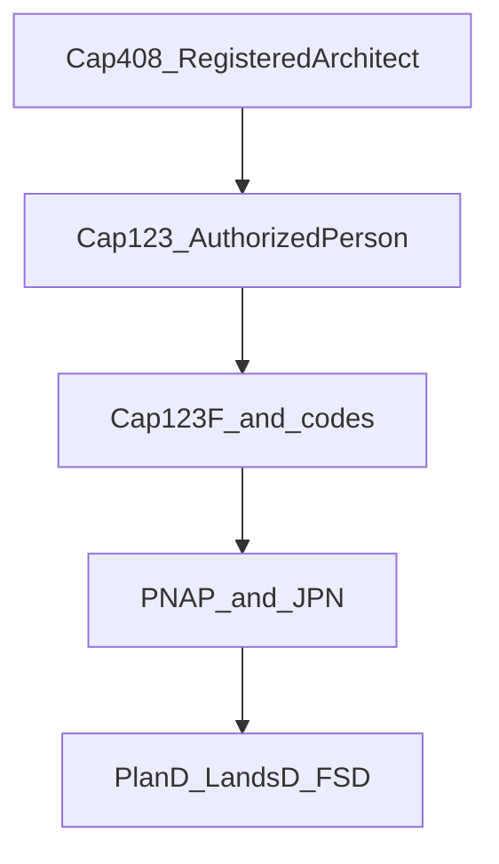

# Statutory reading guide

How to read this folder for a working understanding of the statutory requirements to practise as an architect in Hong Kong.

[`_CS_INVENTORY.md`](_CS_INVENTORY.md) lists **914** critical summaries (`*_CS.md`). [`DOCUMENTS_WITHOUT_CS.md`](DOCUMENTS_WITHOUT_CS.md) lists **1,101** source files that do not have a paired `*_CS.md` name. Most of those source files are the PDFs behind summaries that already exist, plus the Practice Notes for Authorized Persons (PNAP) library.

PNAP is saved here and is the daily working set, and it is absent from the inventory count. About **222** summaries sit in [`Practice Notes for Authorized Persons (PNAP)/summaries`](Building%20Department%20(BD)/Practice%20Notes%20for%20Authorized%20Persons%20(PNAP)/summaries) without the `_CS` suffix. Start from [`PNAP_APP_Table_English.md`](Building%20Department%20(BD)/Practice%20Notes%20for%20Authorized%20Persons%20(PNAP)/PNAP_APP_Table_English.md) and [`ADM-1 Practice Notes in Force`](Building%20Department%20(BD)/Practice%20Notes%20for%20Authorized%20Persons%20(PNAP)/summaries/ADM-1%20Practice%20Notes%20in%20Force.md).

Read the tiers below. The rest of the folder is a lookup shelf: open a file when a job needs that item. Roughly 400 inventory entries are individual minor-works web pages, and about 235 are Lands Department circulars.

## Two different licences

This library covers both gates.

- **Registered Architect** under [Cap 408 Architects Registration Ordinance](HKARB/Cap%20408%20Architects%20Registration%20Ordinance/Cap%20408%20%2830-09-2020%29_Architects%20Registration%20Ordinance_CS.md): who may use the title "architect", "registered architect", or the initials "R.A." (Registered Architect). This is the Architects Registration Board. It does not approve building plans.
- **Authorized Person (AP)** under [Cap 123 Buildings Ordinance](Building%20Department%20(BD)/Cap%20123%20Building%20Ordience/Cap%20123%20%2801-03-2026%29_Buildings%20Ordinance_CS.md): the statutory coordinator who submits plans, supervises, and applies for an occupation permit (OP). An architect becomes an AP only after separate registration with the Building Authority (BA).

Read Cap 408 for the title, then Cap 123 for the statutory job.

Legal force, strongest first: Ordinance, then subsidiary regulation (Cap 123A to Cap 123Q), then a Code of Practice accepted by the BA, then a practice note. A practice note states how the BA applies the law. A government lease and the site Outline Zoning Plan (OZP) can be stricter than the Buildings Ordinance. BEAM Plus (Building Environmental Assessment Method Plus) brochures in this folder are a voluntary assessment, outside the statutory core.

## Tier 1 — read in full

Right to practise, and the path from appointment to occupation permit.

- [Cap 408 (30 September 2020)](HKARB/Cap%20408%20Architects%20Registration%20Ordinance/Cap%20408%20%2830-09-2020%29_Architects%20Registration%20Ordinance_CS.md) — qualification routes, one year of Hong Kong experience, ordinary residence, annual renewal (apply between 3 months and 28 days before expiry), title control, how a practice may be described, discipline.
- [Cap 123 (1 March 2026)](Building%20Department%20(BD)/Cap%20123%20Building%20Ordience/Cap%20123%20%2801-03-2026%29_Buildings%20Ordinance_CS.md) — definitions, appointment of the AP, Registered Structural Engineer (RSE), Registered Geotechnical Engineer (RGE) and registered contractor, section 14 approval and consent, section 16 refusal, supervision plan, section 21 occupation permit, unauthorized building works (UBW), exemptions in section 41.
- [Cap 121](Building%20Department%20(BD)/Cap%20121%20Buildings%20Ordinance%20%28Application%20to%20the%20New%20Territories%29%20Ordinance/Cap%20121%20%2802-08-2012%29_Buildings%20Ordinance%20%28Application%20to%20the%20New%20Territories%29%20Ordinance_CS.md) — Cap 123 applies in the New Territories only as this ordinance provides.
- [Cap 123A Building (Administration) Regulations](Building%20Department%20(BD)/Cap%20123%20Building%20Ordience/Cap%20123A%20%2830-06-2024%29_Building%20%28Administration%29%20Regulations_CS.md) — plan packages, specified forms, and the paperwork of submission.
- [Cap 123F Building (Planning) Regulations](Building%20Department%20(BD)/Cap%20123%20Building%20Ordience/Cap%20123F%20%2816-06-2024%29_Building%20%28Planning%29%20Regulations_CS.md) — the architect's dimensional statute: site coverage, plot ratio, streets, lighting and ventilation, projections, means of escape.
- [Cap 123Q Building (Construction) Regulation](Building%20Department%20(BD)/Cap%20123%20Building%20Ordience/Cap%20123Q%20%2824-06-2021%29_Building%20%28Construction%29%20Regulation_CS.md) — materials and construction performance. [Cap 123B](Building%20Department%20(BD)/Cap%20123%20Building%20Ordience/Cap%20123B%20%2801-02-2021%29_Building%20%28Construction%29%20Regulations_CS.md) is the older companion; use it when a project still cites that text.
- PNAP administration, a short set inside the 222 summaries:
  - [ADM-2 Centralised Processing of Building Plans](Building%20Department%20(BD)/Practice%20Notes%20for%20Authorized%20Persons%20(PNAP)/summaries/ADM-2%20Centralised%20Processing%20of%20Building%20Plans.md)
  - [ADM-5 Submissions to the Buildings Department](Building%20Department%20(BD)/Practice%20Notes%20for%20Authorized%20Persons%20(PNAP)/summaries/ADM-5%20Submissions%20to%20the%20Buildings%20Department.md)
  - [ADM-14 Minor Amendments to Plans and Specified Forms](Building%20Department%20(BD)/Practice%20Notes%20for%20Authorized%20Persons%20(PNAP)/summaries/ADM-14%20Minor%20Amendments%20to%20Plans%20and%20Specified%20Forms.md)
  - [ADM-19 Building Approval Process](Building%20Department%20(BD)/Practice%20Notes%20for%20Authorized%20Persons%20(PNAP)/summaries/ADM-19%20Building%20Approval%20Process.md)
  - [APP-13 Completion, occupation permit and record plans](Building%20Department%20(BD)/Practice%20Notes%20for%20Authorized%20Persons%20(PNAP)/summaries/APP-13%20Submission%20of%20Certificate%20of%20Completion%20of%20Building%20Works%2C%20Application%20for%20Occupation%20Permit%20and%20Submission%20of%20Record%20Plans%20and%20Information.md)
- Site duty: [Code of Practice for Site Supervision 2009](Building%20Department%20(BD)/Codes%20of%20Practice%20and%20Design%20Manuals/Site%20and%20Building%20Works/Code%20of%20Practice%20for%20Site%20Supervision%202009_CS.md) (the linked source PDF is the 2024 edition) and the [Technical Memorandum for Supervision Plans 2009](Building%20Department%20(BD)/Codes%20of%20Practice%20and%20Design%20Manuals/Site%20and%20Building%20Works/Technical%20Memorandum%20for%20Supervision%20Plans%202009_CS.md).

## Tier 2 — read the summary; open the source for a figure you will use

Development control and the codes an AP designs to.

### Gross floor area, site coverage, plot ratio

- [APP-2 Calculation of Gross Floor Area and Non-accountable Gross Floor Area](Building%20Department%20(BD)/Practice%20Notes%20for%20Authorized%20Persons%20(PNAP)/summaries/APP-2%20Calculation%20of%20Gross%20Floor%20Area%20and%20Non-accountable%20Gross%20Floor%20Area%20%E2%80%94%20Building%20%28Planning%29%20Regulation%2023%283%29%28a%29%20and%20%28b%29.md)
- [APP-19 Projections in relation to Site Coverage and Plot Ratio](Building%20Department%20(BD)/Practice%20Notes%20for%20Authorized%20Persons%20(PNAP)/summaries/APP-19%20Projections%20in%20relation%20to%20Site%20Coverage%20and%20Plot%20Ratio%20%E2%80%94%20Building%20%28Planning%29%20Regulations%2020%20%26%2021.md)
- [APP-42 Amenity Features](Building%20Department%20(BD)/Practice%20Notes%20for%20Authorized%20Persons%20(PNAP)/summaries/APP-42%20Amenity%20Features.md)
- [APP-104 Exclusion of Floor Areas for Recreational Use](Building%20Department%20(BD)/Practice%20Notes%20for%20Authorized%20Persons%20(PNAP)/summaries/APP-104%20Exclusion%20of%20Floor%20Areas%20for%20Recreational%20Use.md)
- [APP-132 Site Coverage and Open Space Provision](Building%20Department%20(BD)/Practice%20Notes%20for%20Authorized%20Persons%20(PNAP)/summaries/APP-132%20Site%20Coverage%20and%20Open%20Space%20Provision.md)

### Sustainable building design

- [APP-151 Building Design to Foster a Quality and Sustainable Built Environment](Building%20Department%20(BD)/Practice%20Notes%20for%20Authorized%20Persons%20(PNAP)/summaries/APP-151%20Building%20Design%20to%20Foster%20a%20Quality%20and%20Sustainable%20Built%20Environment.md)
- [APP-152 Sustainable Building Design Guidelines](Building%20Department%20(BD)/Practice%20Notes%20for%20Authorized%20Persons%20(PNAP)/summaries/APP-152%20Sustainable%20Building%20Design%20Guidelines.md)
- Joint Practice Notes (JPN), all eight summaries:
  - [JPN 1 Green and Innovative Buildings](Joint%20Practice%20Notes%20%28JPN%29/summaries/Joint%20Practice%20Note%20No.%201%20Green%20and%20Innovative%20Buildings_CS.md)
  - [JPN 2 Second Package of Incentives](Joint%20Practice%20Notes%20%28JPN%29/summaries/Joint%20Practice%20Note%20No.%202%20Second%20Package%20of%20Incentives%20for%20Green%20and%20Innovative%20Buildings_CS.md)
  - [JPN 3 Landscape and Site Coverage of Greenery](Joint%20Practice%20Notes%20%28JPN%29/summaries/Joint%20Practice%20Note%20No.%203%20Landscape%20and%20Site%20Coverage%20of%20Greenery_CS.md)
  - [JPN 4 Plot Ratio and Gross Floor Area](Joint%20Practice%20Notes%20%28JPN%29/summaries/Joint%20Practice%20Note%20No.%204%20Development%20Control%20Parameters%20Plot%20Ratio%20Gross%20Floor%20Area_CS.md)
  - [JPN 5 Building Height Restriction](Joint%20Practice%20Notes%20%28JPN%29/summaries/Joint%20Practice%20Note%20No.%205%20Development%20Control%20Parameters%20Building%20Height%20Restriction_CS.md)
  - [JPN 6 Building Separation and Building Setback](Joint%20Practice%20Notes%20%28JPN%29/summaries/Joint%20Practice%20Note%20No.%206%20Sustainable%20Building%20Design%20Guidelines%20Building%20Separation%20and%20Building%20Setback_CS.md)
  - [JPN 7 Site Coverage Restriction](Joint%20Practice%20Notes%20%28JPN%29/summaries/Joint%20Practice%20Note%20No.%207%20Development%20Control%20Parameters%20Site%20Coverage%20Restriction_CS.md)
  - [JPN 8 Modular Integrated Construction](Joint%20Practice%20Notes%20%28JPN%29/summaries/Joint%20Practice%20Note%20No.%208%20Enhanced%20Facilitation%20Measures%20for%20Modular%20Integrated%20Construction_CS.md)

JPN 4, 5, 6 and 7 are the notes that change gross floor area (GFA), height, setback and site coverage.

### Fire and escape

Current code first:

- [Code of Practice for Fire Safety in Buildings 2011 (2024 Edition)](Building%20Department%20(BD)/Codes%20of%20Practice%20and%20Design%20Manuals/Planning%20and%20Construction/Code%20of%20Practice%20for%20Fire%20Safety%20in%20Buildings%202011%20%282024%20Edition%29_CS.md)
- [APP-153 Code of Practice for Fire Safety in Buildings 2011](Building%20Department%20(BD)/Practice%20Notes%20for%20Authorized%20Persons%20(PNAP)/summaries/APP-153%20Code%20of%20Practice%20for%20Fire%20Safety%20in%20Buildings%202011.md)
- [APP-85 Application of the Revised Fire Safety Codes](Building%20Department%20(BD)/Practice%20Notes%20for%20Authorized%20Persons%20(PNAP)/summaries/APP-85%20Application%20of%20the%20Revised%20Fire%20Safety%20Codes.md)
- [APP-136 Emergency Vehicular Access](Building%20Department%20(BD)/Practice%20Notes%20for%20Authorized%20Persons%20(PNAP)/summaries/APP-136%20Building%20%28Planning%29%20Regulation%2041D%20%E2%80%94%20Emergency%20Vehicular%20Access.md)

In the same [Planning and Construction](Building%20Department%20(BD)/Codes%20of%20Practice%20and%20Design%20Manuals/Planning%20and%20Construction) folder, the 1996 means-of-escape code, the 1996 fire-resisting-construction code, and the 2004 means-of-access code are the pre-2011 regime. Use them when a project is still under that regime.

### Access, energy, lighting, sanitary

- Barrier-free access: [Design Manual: Barrier Free Access 2008 (2025 Edition)](Building%20Department%20(BD)/Codes%20of%20Practice%20and%20Design%20Manuals/Planning%20and%20Construction/Design%20Manual%20Barrier%20Free%20Access%202008%20%282025%20Edition%29_CS.md) with [APP-41](Building%20Department%20(BD)/Practice%20Notes%20for%20Authorized%20Persons%20(PNAP)/summaries/APP-41%20Buildings%20to%20be%20Planned%20for%20Use%20by%20Persons%20with%20a%20Disability%20%E2%80%94%20B%28P%29R%20Regulation%2072%20-%20Design%20Manual%20-%20Barrier%20Free%20Access%202008.md).
- [Code of Practice on Access for External Maintenance 2021](Building%20Department%20(BD)/Codes%20of%20Practice%20and%20Design%20Manuals/Planning%20and%20Construction/Code%20of%20Practice%20on%20Access%20for%20External%20Maintenance%202021_CS.md).
- Statutory energy: [Cap 123M Building (Energy Efficiency) Regulation](Building%20Department%20(BD)/Cap%20123%20Building%20Ordience/Cap%20123M%20%2801-12-2020%29_Building%20%28Energy%20Efficiency%29%20Regulation_CS.md), [Code of Practice for Overall Thermal Transfer Value in Buildings 1995](Building%20Department%20(BD)/Codes%20of%20Practice%20and%20Design%20Manuals/Planning%20and%20Construction/Code%20of%20Practice%20for%20Overall%20Thermal%20Transfer%20Value%20in%20Buildings%201995_CS.md), [APP-67](Building%20Department%20(BD)/Practice%20Notes%20for%20Authorized%20Persons%20(PNAP)/summaries/APP-67%20Energy%20Efficiency%20of%20Buildings%20%E2%80%94%20Building%20%28Energy%20Efficiency%29%20Regulation.md), and [APP-156](Building%20Department%20(BD)/Practice%20Notes%20for%20Authorized%20Persons%20(PNAP)/summaries/APP-156%20Design%20and%20Construction%20Requirements%20for%20Energy%20Efficiency%20of%20Residential%20Buildings.md).
- Sanitary and refuse: [Cap 123I](Building%20Department%20(BD)/Cap%20123%20Building%20Ordience/Cap%20123I%20%2823-04-2020%29_Building%20%28Standards%20of%20Sanitary%20Fitments%2C%20Plumbing%2C%20Drainage%20Works%20and%20Latrines%29%20Regulations_CS.md), [Cap 123H](Building%20Department%20(BD)/Cap%20123%20Building%20Ordience/Cap%20123H%20%2809-02-2012%29_Building%20%28Refuse%20Storage%20and%20Material%20Recovery%20Chambers%20and%20Refuse%20Chutes%29%20Regulations_CS.md), and [Technical Requirements for Plumbing Works in Buildings (April 2026)](Water%20Authority%20%28WSD%29/Technical%20Requirements%20for%20Plumbing%20Works%20in%20Buildings%20%28April%202026%29_CS.md).
- Lighting by performance: [APP-130 Lighting and Ventilation Requirements — Performance-based Approach](Building%20Department%20(BD)/Practice%20Notes%20for%20Authorized%20Persons%20(PNAP)/summaries/APP-130%20Lighting%20and%20Ventilation%20Requirements%20%E2%80%93%20Performance-based%20Approach.md). In this folder, APP-130 is lighting and ventilation.

### Structure (coordination with the RSE)

Read the summaries under [Codes of Practice and Design Manuals/Structure](Building%20Department%20(BD)/Codes%20of%20Practice%20and%20Design%20Manuals/Structure): dead and imposed loads, wind effects 2019, concrete, steel, foundations, glass, and precast concrete. Open an amendment PDF listed in [`DOCUMENTS_WITHOUT_CS.md`](DOCUMENTS_WITHOUT_CS.md) when the project uses that material. Several amendments have no critical summary of their own.

### Filenames to trust in this folder

In the saved PNAP summaries, APP-40 is hotel development, APP-130 is lighting and ventilation, and ADV-36 is modular integrated construction. Choose notes by these filenames. The PNAP index in [`../hk-architect-master/SKILL.md`](../hk-architect-master/SKILL.md) uses different subjects for some of the same numbers.

## Tier 3 — parallel statutes

These regimes can stop a scheme after Cap 123 is satisfied. Read the ordinance summary. Open the rest when the project type needs it.

### Planning

- [Cap 131 Town Planning Ordinance (2 November 2023)](Planning%20Department%20(PlanD)/Cap%20131%20Town%20Planning%20Ordinance/Cap%20131%20%2802-11-2023%29_CS.md). The inventory row for this summary has no source file.
- Then the [OZP Master Schedule of Notes](Planning%20Department%20(PlanD)/OZP%20Master%20Schedule%20of%20Notes/summaries) for the zones in the scheme: Residential (Group A) through (Group E), Commercial, Industrial, Other Specified Uses (Business), Other Specified Uses (Mixed Use), Comprehensive Development Area, Government Institution or Community, Village Type Development, and the urban and rural covering notes.

A master schedule is a standard form of Notes. It is not the site OZP. The site plan, its Notes, and the lease are checked outside this folder.

### Lease

Read these Lands Administration Office practice notes. The other notes in that folder are transaction-specific (exchange rates, premium tables, one-off waivers): open the note that matches the lease transaction.

- Accountable GFA under the lease: [4/2014](Land%20Department%20(LandD)/LAO%20Practice%20Notes/summaries/LAO%20Practice%20Note%20No.%204_2014%20%28August%202014%29_CS.md) and [4/2014A](Land%20Department%20(LandD)/LAO%20Practice%20Notes/summaries/LAO%20Practice%20Note%20No.%204_2014A%20%28October%202021%29_CS.md)
- Design, disposition and height: [3/2020](Land%20Department%20(LandD)/LAO%20Practice%20Notes/summaries/LAO%20Practice%20Note%20No.%203-2020%20%2827%20April%202020%29_CS.md) and [3/2020A](Land%20Department%20(LandD)/LAO%20Practice%20Notes/summaries/LAO%20Practice%20Note%20No.%203-2020A%20%28August%202021%29_CS.md)
- Building plans under the lease: [2/2018](Land%20Department%20(LandD)/LAO%20Practice%20Notes/summaries/LAO%20Practice%20Note%20No.%202_2018%20%28November%202018%29_CS.md) and [4/2018](Land%20Department%20(LandD)/LAO%20Practice%20Notes/summaries/LAO%20Practice%20Note%20No.%204_2018%20%28November%202018%29_CS.md)
- Approval or consent under lease: [4/2021](Land%20Department%20(LandD)/LAO%20Practice%20Notes/summaries/LAO%20Practice%20Note%20No.%204-2021%20%28December%202021%29_CS.md)
- Certificate of compliance: [1/2026](Land%20Department%20(LandD)/LAO%20Practice%20Notes/summaries/LAO%20Practice%20Note%20No.%201-2026%20%28January%202026%29_CS.md)
- New Territories Exempted Houses only: [1/2025](Land%20Department%20(LandD)/LAO%20Practice%20Notes/summaries/LAO%20Practice%20Note%20No.%201-2025%20%28January%202025%29_CS.md)

### Fire services installations

- Current code: [FSD Circular Letter No. 2/2022](Fire%20Department%20(FSD)/summaries/FSD%20Circular%20Letter%20No.%202-2022%20Codes%20of%20Practice%20Minimum%20FSI%20September%202022_CS.md) with the [4/2024 corrigendum](Fire%20Department%20(FSD)/summaries/FSD%20Circular%20Letter%20No.%204-2024%20Corrigendum%20Codes%20of%20Practice%20Minimum%20FSI%20September%202022_CS.md)
- Acceptance of new buildings: [FSD Circular Letter No. 1/2020](Fire%20Department%20(FSD)/summaries/FSD%20Circular%20Letter%20No.%201-2020%20Revised%20Application%20Procedure%20for%20Inspection%20and%20Testing%20of%20FSI%20in%20New%20Buildings_CS.md)

The 1998, 2005 and 2012 fire service installation (FSI) code letters in the same folder record earlier editions.

### Existing buildings

Open this group when the job is an existing building, minor works, or a mandatory inspection.

- Fire safety ordinances: [Cap 502 commercial premises](Building%20Department%20(BD)/Cap%20502%20Fire%20Safety%20%28Commercial%20Premises%29%20Ordinance/Cap%20502%20%2813-12-2024%29_Fire%20Safety%20%28Commercial%20Premises%29%20Ordinance_CS.md), [Cap 572 buildings](Building%20Department%20(BD)/Cap%20572%20Fire%20Safety%20%28Buildings%29%20Ordinance/Cap%20572%20%2813-12-2024%29_Fire%20Safety%20%28Buildings%29%20Ordinance_CS.md), [Cap 636 industrial buildings](Building%20Department%20(BD)/Cap%20636%20Fire%20Safety%20%28Industrial%20Buildings%29%20Ordinance/Cap%20636%20%2810-09-2020%29_Fire%20Safety%20%28Industrial%20Buildings%29%20Ordinance_CS.md)
- Minor works: [Cap 123N](Building%20Department%20(BD)/Cap%20123%20Building%20Ordience/Cap%20123N%20%2831-03-2022%29_Building%20%28Minor%20Works%29%20Regulation_CS.md), the [Minor Works Control System pamphlet summary](Building%20Department%20(BD)/Minor%20Works%20%28MWCS%29/Minor%20Works%20Control%20System_CS.md), and [APP-147 Minor Works Control System](Building%20Department%20(BD)/Practice%20Notes%20for%20Authorized%20Persons%20(PNAP)/summaries/APP-147%20Minor%20Works%20Control%20System.md). Look up an item number in the minor-works pages when the regulation points to it.
- Mandatory inspection: [Cap 123P](Building%20Department%20(BD)/Cap%20123%20Building%20Ordience/Cap%20123P%20%2831-03-2022%29_Building%20%28Inspection%20and%20Repair%29%20Regulation_CS.md), [PNBI-1](Building%20Department%20(BD)/Practice%20Notes%20for%20Mandatory%20Building%20and%20Window%20Inspection%20Schemes%20%28PNBI%29/summaries/PNBI-1%20Practice%20Notes%20for%20Mandatory%20Building%20and%20Window%20Inspection%20Schemes_CS.md), and the Mandatory Building Inspection Scheme / Mandatory Window Inspection Scheme code. PNBI-2 to PNBI-9 are forms and procedure for a live inspection job.

The inventory links the MBIS/MWIS code summary to the 1992 oil-storage PDF. Use the code's own source PDF, `CoP MBIS MWIS 2012 (2023 Edition).pdf`, listed in [`DOCUMENTS_WITHOUT_CS.md`](DOCUMENTS_WITHOUT_CS.md).

### Environment

Read the ordinance summaries: [Cap 311 air](Environmental%20Protection%20Department%20(EPD)/Cap.%20311%20Air%20Pollution%20Control%20Ordinance/Cap%20311%20%2811-04-2025%29_Air%20Pollution%20Control%20Ordinance_CS.md), [Cap 358 water](Environmental%20Protection%20Department%20(EPD)/Cap.%20358%20Water%20Pollution%20Control%20Ordinance/Cap%20358%20%2818-08-2024%29_Water%20Pollution%20Control%20Ordinance_CS.md), [Cap 400 noise](Environmental%20Protection%20Department%20(EPD)/Cap.%20400%20Noise%20Control%20Ordinance/Cap%20400%20%2818-08-2024%29_Noise%20Control%20Ordinance_CS.md). The extra Environmental Protection Department PDFs in [`DOCUMENTS_WITHOUT_CS.md`](DOCUMENTS_WITHOUT_CS.md) are technical memoranda and guides for a chimney, a noise permit, or a discharge.

## Lookup shelf

Open these when the job names them. They are saved so a clause can be found. They are not the reading sequence.

- Minor-works item pages (about 233), category pages (52), and designated-exempted-works pages (37). Cap 123N is the statute; the page is the item.
- Signboard validation pages, when the job is a signboard.
- Practice Notes for Registered Contractors (65 summaries). They are written for contractors. The AP overlap is in the PNAP ADM and APP set and in the site-supervision code.
- All 139 Legal Advisory and Conveyancing Office circular memoranda. They are conveyancing practice.
- Lands Administration Office practice notes outside the lease list in Tier 3.
- Fire Services Department circular letters outside 2/2022, the 4/2024 corrigendum, and 1/2020. Many are product notices, superseded letters, or maintenance checklists.
- BEAM Plus brochures, and the two Construction Industry Council procedure notes on modular integrated construction (MiC) and multi-trade integrated mechanical, electrical and plumbing (MiMEP). A green or MiC brief can use them. The statutory GFA effect of MiC is JPN 8.
- [Cap 344 Building Management Ordinance](Building%20Department%20(BD)/Others/Cap%20344%20%2813-07-2025%29_Building%20Management%20Ordinance_CS.md), when the client is an owners' corporation.
- Split Cap 123 part and schedule markdown files at the top of [`DOCUMENTS_WITHOUT_CS.md`](DOCUMENTS_WITHOUT_CS.md). The consolidated Cap 123 critical summary already covers that ordinance.
- The remaining Cap 123 regulations when the building type needs them: lifts (Cap 123E), escalators (Cap 123D), demolition (Cap 123C), private streets (Cap 123G), ventilating systems (Cap 123J), oil storage (Cap 123K), appeals (Cap 123L), minor-works fees (Cap 123O).

## Still outside this folder

A complete practice picture also needs documents that are not saved here:

- Architects Registration Board code of professional conduct
- Hong Kong Institute of Architects (HKIA) conditions of engagement
- Hong Kong Planning Standards and Guidelines
- Cap 301 Hong Kong Airport (Control of Obstructions) Ordinance. The practice note that cites it is saved: [APP-32 Airport Height Restrictions](Building%20Department%20(BD)/Practice%20Notes%20for%20Authorized%20Persons%20(PNAP)/summaries/APP-32%20Hong%20Kong%20Airport%20%28Control%20of%20Obstructions%29%20Ordinance%20%28Cap.%20301%29%20%E2%80%94%20Airport%20Height%20Restrictions.md)
- Buildings Energy Efficiency Ordinance, administered by the Electrical and Mechanical Services Department
- The site Outline Zoning Plan and the government lease

On a real site, the site OZP and the lease control the envelope. The master schedules and practice notes in this folder state the general rules those two documents can tighten.
